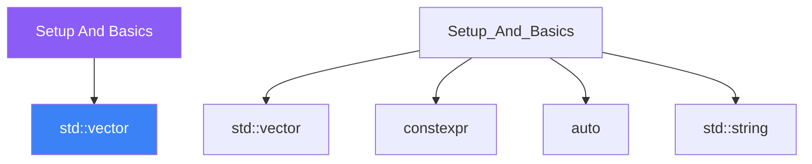

<div class="brain-cluster-banner" data-cluster="foundations">
  🔵 &nbsp; **Foundations** &nbsp;·&nbsp; Frontal Lobe
</div>


# :material-book: 02 — Definition: Setup And Basics

[← Intuition](01-intuition.md) · [Code Example →](03-example.md)

!!! info "🔵 Blue = Theory — Precise, formal, complete"
    Read this section carefully. Every word matters.
    After reading, close the page and explain it back in your own words.

---


## :material-book: Why This Day Matters

Before writing a single meaningful line of C++, you need a reliable foundation: a working toolchain, a build system you understand, and automated quality gates that catch problems before they reach review. Skipping this setup leads to "works on my machine" bugs, silent undefined behaviour from missing warning flags, and style drift that makes code reviews painful.

This day gives you a professional-grade C++ workspace that will serve every subsequent day of the course. Invest the time here — it pays compound interest for thirty days.

## :material-book: The C++ Compilation Pipeline

Understanding what actually happens when you type `g++ main.cpp` demystifies linker errors, header include-order problems, and optimisation flags.

    Source (.cpp)
         |
         v
    [ Preprocessor ]   -- expands #include, #define, #ifdef
         |
         v
    Translation Unit (.ii)
         |
         v
    [ Compiler ]       -- parses C++, performs semantic analysis, generates IR
         |
         v
    Object File (.o)
         |
         v
    [ Linker ]         -- resolves symbols across translation units, produces executable
         |
         v
    Executable (a.out / your_binary)

Each stage produces distinct error messages. A "undefined reference to" error is a **linker** error, not a compiler error. Recognising the stage helps you fix issues faster.

### Preprocessor Pass

The preprocessor runs before any parsing. It performs textual substitution and file inclusion.

``` cpp
// main.cpp — before preprocessing
#include <iostream>
#define GREETING "Hello"

int main() {
    std::cout << GREETING << '\n';
}

// After preprocessing, the compiler sees the entire <iostream> content
// pasted in, and every occurrence of GREETING replaced with "Hello".
// Inspect the output yourself:
//   g++ -E main.cpp -o main.ii
```

## :material-book: Compiler Flags That Matter

Flags are not optional polish — they are safety nets. The following set is the default for every project in this course.

``` cmake
# CMakeLists.txt — project-wide compile options
add_compile_options(
    -Wall             # Enable most common warnings
    -Wextra           # Enable extra warnings that -Wall misses
    -Wpedantic        # Enforce strict ISO compliance
    -Werror           # Treat warnings as errors — catch issues early
    -Wshadow          # Warn when a local variable shadows an outer one
    -Wnon-virtual-dtor   # Warn on class with virtual functions but non-virtual dtor
    -Wold-style-cast     # Warn on C-style casts; use static_cast/reinterpret_cast
    -Wconversion         # Warn on implicit narrowing conversions
    -Wsign-conversion    # Warn on signed/unsigned mismatch
)
```

Why each flag matters:

- `-Wall` catches uninitialised variables, unused results, mismatched printf formats.
- `-Wextra` adds missing field initialisers, extra semicolons, and more.
- `-Wshadow` prevents subtle bugs where `int x` in a nested scope hides a class member `x`.
- `-Wconversion` is critical: `int x = 3.7;` compiles silently without it, truncating the value.
- `-Werror` makes the build fail on warnings — forcing you to fix issues immediately rather than accumulate technical debt.

### Debug vs Release Builds

``` cmake
# Debug: full symbol info, no optimisation, sanitisers enabled
if(CMAKE_BUILD_TYPE STREQUAL "Debug")
    add_compile_options(-g -O0)
    add_compile_options(-fsanitize=address,undefined)
    add_link_options(-fsanitize=address,undefined)
endif()

# Release: aggressive optimisation, strip assert() calls
if(CMAKE_BUILD_TYPE STREQUAL "Release")
    add_compile_options(-O2 -DNDEBUG)
endif()
```

Always develop in **Debug** with sanitisers. Ship in **Release**. Never benchmark in Debug.


---

## :material-vector-polyline: Knowledge Map (SPATIAL MEMORY — Feature 7)




---

## :material-memory: Quick Definitions Table

| Term | Meaning |
|------|---------|
| `std::vector` | _std::vector — key concept for Setup And Basics_ |
| `constexpr` | _constexpr — key concept for Setup And Basics_ |
| `auto` | _auto — key concept for Setup And Basics_ |
| `std::string` | _std::string — key concept for Setup And Basics_ |
| `namespaces` | _namespaces — key concept for Setup And Basics_ |


---

[← Intuition](01-intuition.md) · [Code Example →](03-example.md)
