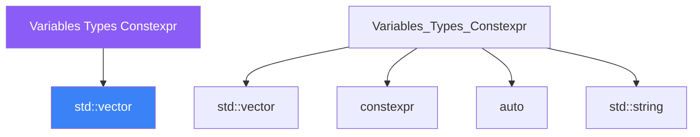

<div class="brain-cluster-banner" data-cluster="foundations">
  🔵 &nbsp; **Foundations** &nbsp;·&nbsp; Frontal Lobe
</div>


# :material-book: 02 — Definition: Variables Types Constexpr

[← Intuition](01-intuition.md) · [Code Example →](03-example.md)

!!! info "🔵 Blue = Theory — Precise, formal, complete"
    Read this section carefully. Every word matters.
    After reading, close the page and explain it back in your own words.

---


## :material-book: Why This Day Matters

Types are the backbone of C++. The type system lets the compiler prove correctness, enable optimisations, and catch entire classes of bugs before the program ever runs. Choosing the right type, initialising it correctly, and understanding when a value is known at compile time versus runtime determines the quality of code you write for the rest of the course.

This day covers the vocabulary every subsequent day relies on: fundamental types, `auto`, `const`, `constexpr`, structured bindings, value categories, brace initialisation, and the hazards of implicit narrowing.

## :material-book: Fundamental Types

C++ provides a set of built-in types with platform-defined but bounded sizes.

``` cpp
#include <cstdint>   // fixed-width types
#include <climits>   // INT_MAX, UINT_MAX, ...

// Prefer fixed-width types whenever bit width matters
std::int32_t  sensor_id   = 42;       // exactly 32 bits, signed
std::uint64_t packet_count = 0;       // exactly 64 bits, unsigned
std::int8_t   flags        = 0x0F;    // exactly 8 bits

// Use native types when performance matters and width is not the concern
int           loop_counter = 0;       // fast integer on this platform
std::size_t   index        = 0;       // correct type for array indices
std::ptrdiff_t diff        = p2 - p1; // correct type for pointer differences

// Floating-point
float       single_precision = 3.14f;  // 32-bit, suffix 'f' avoids narrowing
double      result           = 0.0;    // 64-bit, default for most calculations
long double extended         = 0.0L;   // 80 or 128-bit platform-dependent
```

**Why avoid \`\`int\`\` for everything?**

`int` is at least 16 bits but commonly 32. On a 32-bit embedded system, `int` is 32 bits; on a 64-bit desktop, `long` might be 32 or 64 bits depending on the ABI. Use `std::int32_t` when the exact width is a protocol requirement.

## :material-book: Brace Initialisation — The Modern Default

C++11 introduced uniform brace initialisation, which should be your default. It prevents narrowing conversions at compile time.

``` cpp
// Brace init: safe, consistent, prevents narrowing
int   a{42};           // OK
int   b{3.7};          // ERROR: narrowing conversion from double to int
float c{1.0};          // WARNING/ERROR: double -> float may lose precision

// Old-style init: silent narrowing
int   d = 3.7;         // silently truncates to 3 — a bug that compiles cleanly
int   e(3.7);          // also silently truncates — confusingly allowed

// Value-initialise to zero with empty braces
int   f{};             // f == 0
double g{};            // g == 0.0

// Aggregate initialisation
struct Point { int x; int y; };
Point p{10, 20};       // clear, no constructor needed

// std::vector with element list
std::vector<int> v{1, 2, 3, 4, 5};
```

**Design rule:** Prefer `{}` for all variable initialisation. Use `=` only when the right-hand side is the same type and you want to communicate "copy this value".


---

## :material-vector-polyline: Knowledge Map (SPATIAL MEMORY — Feature 7)




---

## :material-memory: Quick Definitions Table

| Term | Meaning |
|------|---------|
| `std::vector` | _std::vector — key concept for Variables Types Constexpr_ |
| `constexpr` | _constexpr — key concept for Variables Types Constexpr_ |
| `auto` | _auto — key concept for Variables Types Constexpr_ |
| `std::string` | _std::string — key concept for Variables Types Constexpr_ |
| `namespaces` | _namespaces — key concept for Variables Types Constexpr_ |


---

[← Intuition](01-intuition.md) · [Code Example →](03-example.md)
