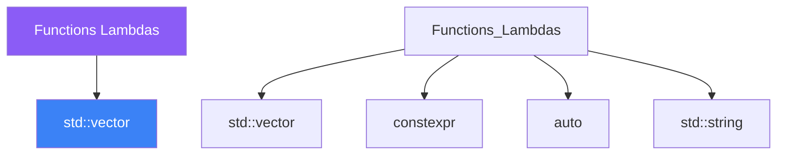

<div class="brain-cluster-banner" data-cluster="foundations">
  🔵 &nbsp; **Foundations** &nbsp;·&nbsp; Frontal Lobe
</div>


# :material-book: 02 — Definition: Functions Lambdas

[← Intuition](01-intuition.md) · [Code Example →](03-example.md)

!!! info "🔵 Blue = Theory — Precise, formal, complete"
    Read this section carefully. Every word matters.
    After reading, close the page and explain it back in your own words.

---


## :material-book: Why This Day Matters

Functions are the primary unit of abstraction in C++. Getting their signatures right — parameter passing conventions, return types, overloading rules — determines whether your code is safe, efficient, and easy to reason about. Lambdas bring closures and local higher-order functions to C++, enabling expressive algorithm use without the boilerplate of named function objects.

This day covers the full spectrum: classic function design, `inline`, default arguments, overloading, and then the modern lambda mechanism including capture modes, `mutable`, generic lambdas, `std::function`, and function pointers.

## :material-book: Function Signatures and Parameter Passing

The single most impactful decision in a function signature is how to pass each parameter.

``` cpp
#include <string>
#include <vector>

// Pass by value: the function gets its own copy.
// Use when: the function needs to modify the data independently,
//           or when the type is cheap to copy (int, float, small structs).
void greet(std::string name) {
    name += " Smith";   // modifies the local copy only
}

// Pass by const reference: no copy, read-only.
// Use for: large objects you only read (strings, vectors, custom types).
void print_report(const std::vector<int>& data) {
    for (int v : data) { /* read-only */ }
}

// Pass by non-const reference: caller's object is modified.
// Use when: the function's purpose is to mutate the argument.
void fill_with_zeros(std::vector<int>& data) {
    std::fill(data.begin(), data.end(), 0);
}

// Pass by rvalue reference: transfer ownership / enable move semantics.
// Use when: the function will consume the argument (store it, move it on).
void append_log(std::vector<std::string>& log, std::string&& entry) {
    log.push_back(std::move(entry));   // entry is moved, not copied
}

// Pass by pointer: the parameter is optional (can be nullptr).
// Use sparingly; prefer references when the argument is always present.
void configure(const Config* cfg) {
    if (cfg) { /* use cfg */ }
}
```

The **golden rule**: pass by `const T&` unless you need a copy or a mutation. Use value parameters when the function will always make a copy internally (the compiler can then use move semantics at the call site).

### Return Types

``` cpp
// Return by value: the compiler applies NRVO/copy elision — no copy penalty.
std::vector<int> generate_sequence(int n) {
    std::vector<int> result;
    result.reserve(n);
    for (int i{0}; i < n; ++i) result.push_back(i);
    return result;   // NRVO: likely zero copies
}

// Return by const reference: only safe for member variables with >= object lifetime.
const std::string& get_name() const { return m_name; }

// Return optional for operations that may fail
#include <optional>
std::optional<int> parse_int(const std::string& s) {
    try { return std::stoi(s); }
    catch (...) { return std::nullopt; }
}

// Trailing return type (required when return type references a parameter type)
auto make_pair_copy(auto a, auto b) -> std::pair<decltype(a), decltype(b)> {
    return {a, b};
}
```

## :material-book: Default Arguments

Default arguments let callers omit trailing parameters, providing a natural API extension path.

``` cpp
// Default arguments must appear in the declaration (header), not definition
void connect(const std::string& host,
             int port = 443,
             bool tls  = true);

// Usage
connect("api.example.com");           // port=443, tls=true
connect("api.example.com", 8080);     // port=8080, tls=true
connect("api.example.com", 80, false);
```

**Tradeoff:** Default arguments make callers concise but can hide the actual arguments being passed, making code harder to read at the call site. Consider named parameter structs for functions with many optional parameters.


---

## :material-vector-polyline: Knowledge Map (SPATIAL MEMORY — Feature 7)




---

## :material-memory: Quick Definitions Table

| Term | Meaning |
|------|---------|
| `std::vector` | _std::vector — key concept for Functions Lambdas_ |
| `constexpr` | _constexpr — key concept for Functions Lambdas_ |
| `auto` | _auto — key concept for Functions Lambdas_ |
| `std::string` | _std::string — key concept for Functions Lambdas_ |
| `namespaces` | _namespaces — key concept for Functions Lambdas_ |


---

[← Intuition](01-intuition.md) · [Code Example →](03-example.md)
