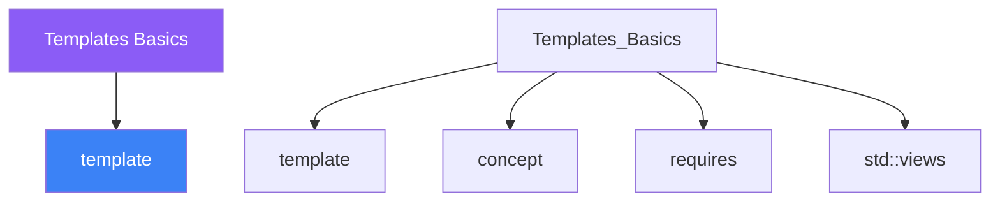

<div class="brain-cluster-banner" data-cluster="templates">
  🟣 &nbsp; **Templates** &nbsp;·&nbsp; Parietal Lobe
</div>


# :material-book: 02 — Definition: Templates Basics

[← Intuition](01-intuition.md) · [Code Example →](03-example.md)

!!! info "🔵 Blue = Theory — Precise, formal, complete"
    Read this section carefully. Every word matters.
    After reading, close the page and explain it back in your own words.

---


## :material-book: Motivation

Imagine writing `max()` once for `int`, then again for `double`, then again for `std::string`. Duplicated logic, duplicated bugs, duplicated maintenance. C++ templates let you write code once and instantiate it for any type that supports the required operations — fully type-safe, zero runtime overhead.

Templates are the foundation of the C++ Standard Library. `std::vector`, `std::sort`, `std::pair`, `std::optional` — all templates. Mastering them unlocks library-quality reusable code.

## :material-book: Function Templates

A function template is a blueprint. The compiler stamps out a concrete function for each combination of template arguments it encounters.

``` cpp
#include <string>
#include <iostream>

// Template parameter T is deduced from the call arguments
template <typename T>
T max_of(T a, T b) {
    return (a > b) ? a : b;
}

int    i = max_of(3, 7);          // T = int
double d = max_of(1.5, 2.7);      // T = double
// explicit template argument when deduction would be ambiguous
auto x = max_of<long>(42, 100L);
```

**Multiple template parameters**

``` cpp
// Trailing return type deduced from the expression type
template <typename T, typename U>
auto add(T a, U b) -> decltype(a + b) {
    return a + b;
}

// C++14: auto return type (compiler deduces from the return statement)
template <typename T, typename U>
auto multiply(T a, U b) { return a * b; }

auto r1 = add(1, 2.5);     // double
auto r2 = multiply(3, 4L); // long
```

## :material-book: Class Templates

Class templates parametrise entire classes. Every member function is itself a template function of the class template parameters.

``` cpp
#include <cassert>
#include <stdexcept>

// A fixed-capacity stack; Capacity has a default value
template <typename T, std::size_t Capacity = 16>
class FixedStack {
    T           data_[Capacity];
    std::size_t size_{0};
public:
    void push(const T& v) {
        if (size_ == Capacity) throw std::overflow_error{"stack full"};
        data_[size_++] = v;
    }
    T pop() {
        if (size_ == 0) throw std::underflow_error{"stack empty"};
        return data_[--size_];
    }
    bool        empty() const { return size_ == 0; }
    std::size_t size()  const { return size_; }
};

FixedStack<int, 8> int_stack;    // explicit capacity
FixedStack<double> dbl_stack;    // default capacity = 16

int_stack.push(1);
int_stack.push(2);
assert(int_stack.pop() == 2);
```

**Out-of-class member function definition**

``` cpp
template <typename T, std::size_t Capacity>
void FixedStack<T, Capacity>::push(const T& v) {
    if (size_ == Capacity) throw std::overflow_error{"stack full"};
    data_[size_++] = v;
}
// Both template parameters must be repeated on every out-of-class definition.
```


---

## :material-vector-polyline: Knowledge Map (SPATIAL MEMORY — Feature 7)




---

## :material-memory: Quick Definitions Table

| Term | Meaning |
|------|---------|
| `template` | _template — key concept for Templates Basics_ |
| `concept` | _concept — key concept for Templates Basics_ |
| `requires` | _requires — key concept for Templates Basics_ |
| `std::views` | _std::views — key concept for Templates Basics_ |
| `ranges` | _ranges — key concept for Templates Basics_ |


---

[← Intuition](01-intuition.md) · [Code Example →](03-example.md)
