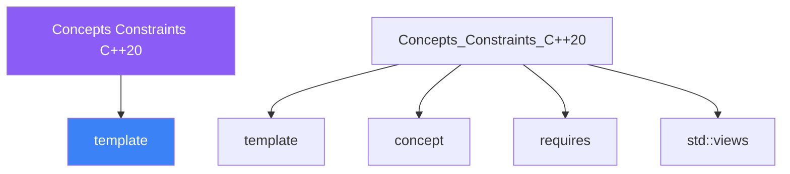

<div class="brain-cluster-banner" data-cluster="templates">
  🟣 &nbsp; **Templates** &nbsp;·&nbsp; Parietal Lobe
</div>


# :material-book: 02 — Definition: Concepts Constraints C++20

[← Intuition](01-intuition.md) · [Code Example →](03-example.md)

!!! info "🔵 Blue = Theory — Precise, formal, complete"
    Read this section carefully. Every word matters.
    After reading, close the page and explain it back in your own words.

---


## :material-book: Motivation

Before C++20, template error messages were infamous. Pass the wrong type to `std::sort` and the compiler might emit forty lines of nested template errors pointing deep into library internals — far from the actual mistake.

C++20 **concepts** fix this. A concept is a named compile-time predicate that constrains template parameters. When a constraint is violated:

- The compiler reports a clear, one-line error at the call site.
- Overload resolution picks the *most constrained* matching overload automatically.
- Code communicates intent — `Sortable T` is self-documenting.

Concepts are not a runtime mechanism. They have zero overhead; they exist only during compilation.

## :material-book: The `requires` Clause

A `requires` clause attaches a constraint to a template or function. The constraint is a compile-time Boolean expression.

``` cpp
#include <concepts>
#include <string>
#include <iostream>

// Constrain with a standard library concept
template <typename T>
requires std::integral<T>
T factorial(T n) {
    return (n <= 1) ? T{1} : n * factorial(n - 1);
}

// factorial(5)   -- OK, int satisfies std::integral
// factorial(5.0) -- ERROR: double does not satisfy std::integral
//                   Compiler says: "constraints not satisfied" at the call site

// requires clause with a compound predicate
template <typename T>
requires std::integral<T> || std::floating_point<T>
T square(T v) { return v * v; }

// Inline requires — after the template parameter list
template <typename T>
T cube(T v) requires std::is_arithmetic_v<T> {
    return v * v * v;
}
```

## :material-book: Defining Your Own Concepts

A concept is defined with the `concept` keyword. The body is a `requires` expression that tests whether the type satisfies certain syntactic and semantic requirements.

``` cpp
#include <concepts>
#include <string>
#include <sstream>

// Concept: T must support operator<< to std::ostream
template <typename T>
concept Printable = requires(T v, std::ostream& os) {
    { os << v } -> std::same_as<std::ostream&>;
};

// Concept: T must have .size() returning something convertible to size_t
template <typename T>
concept Sizeable = requires(T t) {
    { t.size() } -> std::convertible_to<std::size_t>;
};

// Concept: T is a container — has begin(), end(), and size()
template <typename T>
concept Container = requires(T t) {
    { t.begin()  } -> std::input_or_output_iterator;
    { t.end()    } -> std::sentinel_for<decltype(t.begin())>;
    { t.size()   } -> std::convertible_to<std::size_t>;
    requires std::copy_constructible<T>;
};

// Use the concept
template <Printable T>
void print(const T& v) {
    std::cout << v << '\n';
}

template <Container C>
void print_all(const C& c) {
    for (const auto& elem : c)
        std::cout << elem << ' ';
    std::cout << '\n';
}

// print("hello");           // OK: string literals support <<
// print(std::vector<int>{}); // ERROR: vector<int> does not satisfy Printable
```


---

## :material-vector-polyline: Knowledge Map (SPATIAL MEMORY — Feature 7)




---

## :material-memory: Quick Definitions Table

| Term | Meaning |
|------|---------|
| `template` | _template — key concept for Concepts Constraints C++20_ |
| `concept` | _concept — key concept for Concepts Constraints C++20_ |
| `requires` | _requires — key concept for Concepts Constraints C++20_ |
| `std::views` | _std::views — key concept for Concepts Constraints C++20_ |
| `ranges` | _ranges — key concept for Concepts Constraints C++20_ |


---

[← Intuition](01-intuition.md) · [Code Example →](03-example.md)
