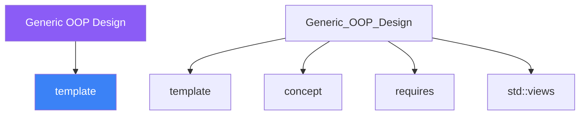

<div class="brain-cluster-banner" data-cluster="templates">
  🟣 &nbsp; **Templates** &nbsp;·&nbsp; Parietal Lobe
</div>


# :material-book: 02 — Definition: Generic OOP Design

[← Intuition](01-intuition.md) · [Code Example →](03-example.md)

!!! info "🔵 Blue = Theory — Precise, formal, complete"
    Read this section carefully. Every word matters.
    After reading, close the page and explain it back in your own words.

---


## :material-book: Motivation

Runtime polymorphism — virtual functions and base-class pointers — is powerful but carries costs: vtable indirection on every call, forced heap allocation, inability to inline, and loss of type information that prevents certain optimisations.

Generic (compile-time) OOP offers the same flexibility without those costs. The idea: express variation through **template parameters** rather than virtual dispatch.

- **Policy-based design** — parametrise a class on its "policy" objects so each combination is compiled independently and fully inlined.
- **Type-safe containers** — use template parameters to enforce element types at compile time.
- **Generic algorithms with concepts** — write algorithms once, constrain via concepts, and let the compiler select the best implementation.
- **Template method pattern** — implement the invariant structure in a base; let derived classes or template arguments supply the varying steps.

## :material-book: Policy-Based Design

Popularised by Andrei Alexandrescu's *Modern C++ Design*, policy-based design uses template parameters as "policies" — small classes that implement one aspect of behaviour. The host class assembles them.

``` cpp
#include <iostream>
#include <mutex>
#include <cstddef>

// Policy 1: Thread-safety policies
struct SingleThreaded {
    struct Lock { Lock() {} };   // no-op lock — zero overhead
};

struct MultiThreaded {
    std::mutex mutex_;
    struct Lock {
        explicit Lock(std::mutex& m) : guard_(m) {}
        std::lock_guard<std::mutex> guard_;
    };
};

// Policy 2: Growth policies for a resizable array
struct DoubleGrowth {
    static std::size_t next_capacity(std::size_t current) {
        return current == 0 ? 1 : current * 2;
    }
};

struct FibonacciGrowth {
    static std::size_t next_capacity(std::size_t current) {
        return current < 2 ? current + 1 : current + (current / 2);
    }
};

// Host class assembles policies
template <typename T,
          typename ThreadingPolicy = SingleThreaded,
          typename GrowthPolicy    = DoubleGrowth>
class DynamicArray : private ThreadingPolicy {
    T*          data_{nullptr};
    std::size_t size_{0};
    std::size_t capacity_{0};
public:
    void push_back(const T& v) {
        typename ThreadingPolicy::Lock lock;
        (void)lock;
        if (size_ == capacity_) grow();
        data_[size_++] = v;
    }
    std::size_t size() const { return size_; }
private:
    void grow() {
        capacity_ = GrowthPolicy::next_capacity(capacity_);
        T* new_data = new T[capacity_];
        for (std::size_t i = 0; i < size_; ++i)
            new_data[i] = std::move(data_[i]);
        delete[] data_;
        data_ = new_data;
    }
};

// Instantiate different combinations with zero overhead — each is a distinct type
using FastArray   = DynamicArray<int, SingleThreaded, DoubleGrowth>;
using SafeArray   = DynamicArray<int, MultiThreaded,  DoubleGrowth>;
using EcoArray    = DynamicArray<int, SingleThreaded, FibonacciGrowth>;
```

**Why policies beat virtual dispatch here**: each combination produces a distinct compiled type. The compiler inlines `DoubleGrowth::next_capacity` and eliminates the lock entirely for `SingleThreaded`. No indirection.

ASCII diagram — policy-based assembly:

    DynamicArray<T, Threading, Growth>
    ┌──────────────────────────────────┐
    │  data_ : T*                      │
    │  size_, capacity_                │
    │                                  │
    │  push_back() ──► Threading::Lock │ (inlined by compiler)
    │  grow()      ──► Growth::next_capacity │
    └──────────────────────────────────┘
             ▲                  ▲
    SingleThreaded          DoubleGrowth
    (no-op lock)            (× 2 strategy)

## :material-book: Type-Safe Containers

Raw `void*` containers (the C approach) are fast but unsafe — you can store an `int*` where a `double*` is expected. Template containers enforce element types at compile time with no runtime cost.

``` cpp
#include <vector>
#include <string>
#include <stdexcept>

// A type-safe ring buffer
template <typename T, std::size_t N>
class RingBuffer {
    T           buf_[N];
    std::size_t head_{0}, tail_{0}, count_{0};
public:
    bool empty() const { return count_ == 0; }
    bool full()  const { return count_ == N; }

    void push(T v) {
        if (full()) throw std::overflow_error{"ring buffer full"};
        buf_[tail_] = std::move(v);
        tail_ = (tail_ + 1) % N;
        ++count_;
    }
    T pop() {
        if (empty()) throw std::underflow_error{"ring buffer empty"};
        T v = std::move(buf_[head_]);
        head_ = (head_ + 1) % N;
        --count_;
        return v;
    }
};

RingBuffer<int, 8>         sensor_queue;
RingBuffer<std::string, 4> message_queue;
// sensor_queue.push("oops"); // compile error — type mismatch
```


---

## :material-vector-polyline: Knowledge Map (SPATIAL MEMORY — Feature 7)




---

## :material-memory: Quick Definitions Table

| Term | Meaning |
|------|---------|
| `template` | _template — key concept for Generic OOP Design_ |
| `concept` | _concept — key concept for Generic OOP Design_ |
| `requires` | _requires — key concept for Generic OOP Design_ |
| `std::views` | _std::views — key concept for Generic OOP Design_ |
| `ranges` | _ranges — key concept for Generic OOP Design_ |


---

[← Intuition](01-intuition.md) · [Code Example →](03-example.md)
