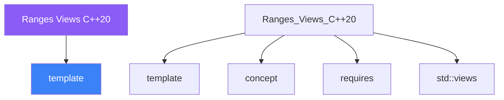

<div class="brain-cluster-banner" data-cluster="templates">
  🟣 &nbsp; **Templates** &nbsp;·&nbsp; Parietal Lobe
</div>


# :material-book: 02 — Definition: Ranges Views C++20

[← Intuition](01-intuition.md) · [Code Example →](03-example.md)

!!! info "🔵 Blue = Theory — Precise, formal, complete"
    Read this section carefully. Every word matters.
    After reading, close the page and explain it back in your own words.

---


## :material-book: Motivation

The classic STL algorithm model is powerful but verbose. Composing three steps — filter, transform, take — requires three separate passes, three temporary containers, and three pairs of begin/end iterators.

``` cpp
// Pre-ranges: three allocations, three loops
std::vector<int> evens, doubled, first5;
std::copy_if(data.begin(), data.end(), std::back_inserter(evens),
             [](int x){ return x % 2 == 0; });
std::transform(evens.begin(), evens.end(), std::back_inserter(doubled),
               [](int x){ return x * 2; });
first5.assign(doubled.begin(),
              doubled.begin() + std::min<int>(5, doubled.size()));
```

C++20 **ranges** and **views** turn this into a single lazy pipeline:

``` cpp
namespace rv = std::ranges::views;
auto result = data
    | rv::filter([](int x){ return x % 2 == 0; })
    | rv::transform([](int x){ return x * 2; })
    | rv::take(5);
// No temporary containers.  Elements are produced on demand.
```

## :material-book: The `std::ranges::views` Pipeline

The pipe operator `|` chains range adaptors. Each adaptor returns a **view** — a lightweight object that describes *how* to iterate, without storing any elements.

``` cpp
#include <ranges>
#include <vector>
#include <iostream>
#include <algorithm>

namespace rv = std::ranges::views;
namespace rg = std::ranges;

std::vector<int> nums{1, 2, 3, 4, 5, 6, 7, 8, 9, 10};

// Pipeline: keep even numbers, double them, take first 3
auto pipeline = nums
    | rv::filter([](int n){ return n % 2 == 0; })
    | rv::transform([](int n){ return n * 2; })
    | rv::take(3);

for (int v : pipeline)
    std::cout << v << ' ';   // 4 8 12
// nums was never modified; no temporaries were created

// Materialise into a vector when you need ownership
std::vector<int> results;
rg::copy(pipeline, std::back_inserter(results));
```

## :material-book: Lazy Evaluation

A view does no work when it is created. Work happens only when the view is iterated. This means:

- Unused elements cost nothing.
- You can build arbitrarily long pipelines with zero intermediate memory.
- Pipelines can operate on infinite ranges.

``` cpp
// Infinite range of natural numbers
auto naturals = rv::iota(1);  // 1, 2, 3, 4, ...

// Take first 5 primes — computed lazily
auto is_prime = [](int n) {
    if (n < 2) return false;
    for (int i = 2; i * i <= n; ++i)
        if (n % i == 0) return false;
    return true;
};

auto first_5_primes = naturals
    | rv::filter(is_prime)
    | rv::take(5);

for (int p : first_5_primes)
    std::cout << p << ' ';  // 2 3 5 7 11
// rv::iota(1) is infinite; rv::take(5) stops after 5 elements
```

ASCII diagram — lazy pipeline execution:

    nums:  1  2  3  4  5  6  7  8  9 10
           │
      filter(even)
           │  2     4     6     8    10
           │
      transform(×2)
           │  4     8    12    16    20
           │
      take(3)
           │  4     8    12
           │
      for loop pulls → iterator advances only 3 elements


---

## :material-vector-polyline: Knowledge Map (SPATIAL MEMORY — Feature 7)




---

## :material-memory: Quick Definitions Table

| Term | Meaning |
|------|---------|
| `template` | _template — key concept for Ranges Views C++20_ |
| `concept` | _concept — key concept for Ranges Views C++20_ |
| `requires` | _requires — key concept for Ranges Views C++20_ |
| `std::views` | _std::views — key concept for Ranges Views C++20_ |
| `ranges` | _ranges — key concept for Ranges Views C++20_ |


---

[← Intuition](01-intuition.md) · [Code Example →](03-example.md)
