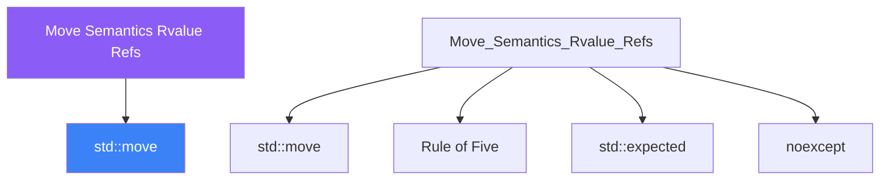

<div class="brain-cluster-banner" data-cluster="memory">
  🔴 &nbsp; **Memory & Error Handling** &nbsp;·&nbsp; Limbic System
</div>


# :material-book: 02 — Definition: Move Semantics Rvalue Refs

[← Intuition](01-intuition.md) · [Code Example →](03-example.md)

!!! info "🔵 Blue = Theory — Precise, formal, complete"
    Read this section carefully. Every word matters.
    After reading, close the page and explain it back in your own words.

---


## :material-book: Motivation

Before C++11, returning a `std::vector<int>` from a function meant a deep copy: allocate new memory, copy every element, deallocate the old. For a vector with a million elements, that is expensive.

Move semantics allow the ownership of resources to be *transferred* instead of *copied*. A moved-from object is left in a valid but unspecified state; the receiving object acquires the resources without any allocation.

C++11 achieves this through **rvalue references** — a new reference category that binds only to temporaries and explicitly moved-from objects.

## :material-book: Value Categories — lvalue, rvalue, xvalue

Every expression in C++ has a **type** and a **value category**.

- **lvalue** (locator value) — an expression that refers to a persistent object in memory. You can take its address. Examples: named variables, dereferenced pointers, subscript expressions on arrays.
- **rvalue** (right-hand-side value) — an expression that does not refer to a persistent object. It is a temporary or a computed value. You cannot take its address in the usual sense. Examples: literals (`42`, `3.14`), function calls returning by value.
- **xvalue** (expiring value) — an rvalue that names an object whose resources can be moved. Produced by `std::move()`, `std::forward()`, or a function returning `T&&`.

``` cpp
int x = 42;
int& lref   = x;       // lvalue reference — binds to x (an lvalue)
int&& rref  = 42;      // rvalue reference — binds to the temporary 42
int&& rref2 = std::move(x);  // xvalue — x is about to be moved from

// &x is valid (lvalue has an address)
// &42 is NOT valid (rvalue does not)
```

ASCII diagram — value categories:

    Expressions
    ├── glvalue (has identity — can be referred to)
    │     ├── lvalue  (persistent object: named variable, *ptr, a[i])
    │     └── xvalue  (expiring: std::move(x), function returning T&&)
    └── rvalue  (no persistent identity)
          ├── prvalue (pure rvalue: 42, true, "hi", f() returning T)
          └── xvalue  (shared with glvalue — "moved-from" objects)

## :material-book: Rvalue References

An rvalue reference `T&&` binds to rvalues (including xvalues) but not to lvalues. It signals "this object can be pillaged — it won't be needed again."

``` cpp
void sink(std::string&&  s) { /* can steal s's buffer */ }
void keep(const std::string& s) { /* read-only, binds to anything */ }

std::string name = "Alice";
keep(name);            // OK: lvalue binds to const&
sink(std::move(name)); // OK: xvalue binds to &&; name is now valid but empty
// sink(name);         // ERROR: lvalue does NOT bind to &&
```


---

## :material-vector-polyline: Knowledge Map (SPATIAL MEMORY — Feature 7)




---

## :material-memory: Quick Definitions Table

| Term | Meaning |
|------|---------|
| `std::move` | _std::move — key concept for Move Semantics Rvalue Refs_ |
| `Rule of Five` | _Rule of Five — key concept for Move Semantics Rvalue Refs_ |
| `std::expected` | _std::expected — key concept for Move Semantics Rvalue Refs_ |
| `noexcept` | _noexcept — key concept for Move Semantics Rvalue Refs_ |
| `rvalue` | _rvalue — key concept for Move Semantics Rvalue Refs_ |


---

[← Intuition](01-intuition.md) · [Code Example →](03-example.md)
