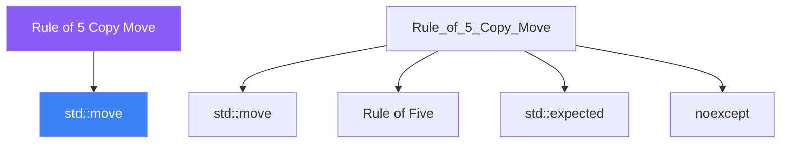

<div class="brain-cluster-banner" data-cluster="memory">
  🔴 &nbsp; **Memory & Error Handling** &nbsp;·&nbsp; Limbic System
</div>


# :material-book: 02 — Definition: Rule of 5 Copy Move

[← Intuition](01-intuition.md) · [Code Example →](03-example.md)

!!! info "🔵 Blue = Theory — Precise, formal, complete"
    Read this section carefully. Every word matters.
    After reading, close the page and explain it back in your own words.

---


## :material-book: Motivation

Every class that manages a resource — raw memory, a file handle, a network socket, a mutex — must answer six questions about object lifetime:

1.  How is the resource created? (constructor)
2.  How is the resource released? (destructor)
3.  What happens when the object is copied? (copy constructor)
4.  What happens when the object is copy-assigned? (copy assignment operator)
5.  What happens when the object is moved? (move constructor)
6.  What happens when the object is move-assigned? (move assignment operator)

Answering these questions correctly and consistently is what the **Rule of Five** (and its modern companion the **Rule of Zero**) is about.

## :material-book: Rule of Zero

The best rule: **if a class does not directly manage a resource, define none of the five special members**. Let the compiler generate them all.

``` cpp
#include <string>
#include <vector>

// No raw pointers, no handles — all members are themselves Rule-of-Zero types
class Person {
    std::string           name_;
    int                   age_{0};
    std::vector<std::string> hobbies_;
public:
    explicit Person(std::string name, int age)
        : name_(std::move(name)), age_(age) {}

    // No destructor, no copy ctor, no copy assign, no move ctor, no move assign
    // The compiler generates all five correctly from the members' operations.
};

Person a{"Alice", 30};
Person b = a;             // deep copy of string and vector — correct
Person c = std::move(a);  // move of string and vector — correct, no allocation
```

## :material-book: Rule of Five

**If you define (or \`\`=delete\`\`) any one of the five special members, you must explicitly handle all five** — because the compiler's implicit generation rules become unreliable once you intervene.

The five special members:

1.  Destructor
2.  Copy constructor
3.  Copy assignment operator
4.  Move constructor
5.  Move assignment operator

``` cpp
#include <cstring>
#include <stdexcept>
#include <utility>

class String {
    char*       data_{nullptr};
    std::size_t len_{0};

    static char* allocate_copy(const char* src, std::size_t n) {
        char* p = new char[n + 1];
        std::memcpy(p, src, n + 1);
        return p;
    }

public:
    // 1. Constructor
    explicit String(const char* s = "")
        : data_(allocate_copy(s, std::strlen(s)))
        , len_(std::strlen(s)) {}

    // 2. Destructor
    ~String() { delete[] data_; }

    // 3. Copy constructor — deep copy
    String(const String& other)
        : data_(allocate_copy(other.data_, other.len_))
        , len_(other.len_) {}

    // 4. Copy assignment operator — copy-and-swap idiom
    String& operator=(String other) {   // pass by value = copy already made
        swap(*this, other);
        return *this;
    }

    // 5. Move constructor — steal resources, O(1)
    String(String&& other) noexcept
        : data_(std::exchange(other.data_, nullptr))
        , len_(std::exchange(other.len_, 0)) {}

    // 6. Move assignment — handled by copy assignment above (pass-by-value)
    //    or explicitly:
    String& operator=(String&& other) noexcept {
        if (this != &other) {
            delete[] data_;
            data_ = std::exchange(other.data_, nullptr);
            len_  = std::exchange(other.len_,  0);
        }
        return *this;
    }

    friend void swap(String& a, String& b) noexcept {
        std::swap(a.data_, b.data_);
        std::swap(a.len_,  b.len_);
    }

    std::size_t length() const { return len_; }
    const char* c_str()  const { return data_ ? data_ : ""; }
};
```


---

## :material-vector-polyline: Knowledge Map (SPATIAL MEMORY — Feature 7)




---

## :material-memory: Quick Definitions Table

| Term | Meaning |
|------|---------|
| `std::move` | _std::move — key concept for Rule of 5 Copy Move_ |
| `Rule of Five` | _Rule of Five — key concept for Rule of 5 Copy Move_ |
| `std::expected` | _std::expected — key concept for Rule of 5 Copy Move_ |
| `noexcept` | _noexcept — key concept for Rule of 5 Copy Move_ |
| `rvalue` | _rvalue — key concept for Rule of 5 Copy Move_ |


---

[← Intuition](01-intuition.md) · [Code Example →](03-example.md)
