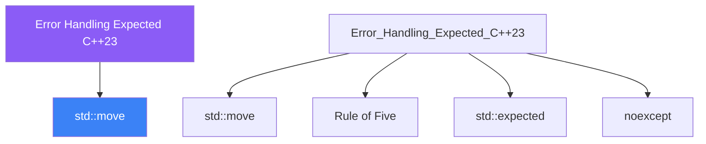

<div class="brain-cluster-banner" data-cluster="memory">
  🔴 &nbsp; **Memory & Error Handling** &nbsp;·&nbsp; Limbic System
</div>


# :material-book: 02 — Definition: Error Handling Expected C++23

[← Intuition](01-intuition.md) · [Code Example →](03-example.md)

!!! info "🔵 Blue = Theory — Precise, formal, complete"
    Read this section carefully. Every word matters.
    After reading, close the page and explain it back in your own words.

---


## :material-book: Motivation

Error handling is one of the most contentious design areas in C++. Three main approaches exist, each with distinct tradeoffs:

- **Exceptions** — the standard mechanism; zero-overhead on the happy path; complex stack unwinding; can make it hard to reason about control flow.
- **Error codes** — explicit, cheap, forces callers to check; but easy to ignore, clutters call sites, and cannot carry rich context.
- **\`\`std::expected\<T, E\>\`\`** (C++23) — a return type that is either a value or an error; makes the error path visible in the type system; enables monadic chaining.

Modern C++ favours the third approach for functions where failure is expected and common, and reserves exceptions for truly exceptional conditions.

## :material-book: Exceptions — Strengths and Weaknesses

``` cpp
#include <stdexcept>
#include <fstream>
#include <string>

std::string read_file(const std::string& path) {
    std::ifstream f(path);
    if (!f) throw std::runtime_error{"cannot open: " + path};
    return std::string{std::istreambuf_iterator<char>(f), {}};
}

// Caller either handles or propagates
try {
    auto text = read_file("config.txt");
    process(text);
} catch (const std::runtime_error& e) {
    std::cerr << "Error: " << e.what() << '\n';
}
```

**When to use exceptions**:

- Truly exceptional conditions (out-of-memory, logic programming errors).
- When error handling belongs far from the error site.
- When many intermediate call frames should not be burdened with error-forwarding.

**Costs**:

- Non-local control flow makes code harder to audit.
- `noexcept` annotations must be carefully maintained.
- Forbidden in many embedded and real-time contexts.
- Exception tables in the binary add size (though runtime cost is near zero on the happy path with Itanium ABI).

## :material-book: `std::optional` — Absent Values

`std::optional<T>` represents a value that may or may not be present. Use it when absence is normal (not an error).

``` cpp
#include <optional>
#include <string>
#include <unordered_map>

std::optional<std::string> find_user(int id,
        const std::unordered_map<int, std::string>& db) {
    auto it = db.find(id);
    if (it == db.end()) return std::nullopt;
    return it->second;
}

auto name = find_user(42, users);
if (name) {
    std::cout << "Found: " << *name << '\n';
} else {
    std::cout << "Not found\n";
}

// value_or — provide a default
std::string display = find_user(99, users).value_or("Anonymous");

// value() — throws std::bad_optional_access if empty
// *opt   — UB if empty; no check
```

**Design rule**: `std::optional<T>` for "no value is a normal outcome." Do NOT use it to represent errors with a reason — use `std::expected` for that.


---

## :material-vector-polyline: Knowledge Map (SPATIAL MEMORY — Feature 7)




---

## :material-memory: Quick Definitions Table

| Term | Meaning |
|------|---------|
| `std::move` | _std::move — key concept for Error Handling Expected C++23_ |
| `Rule of Five` | _Rule of Five — key concept for Error Handling Expected C++23_ |
| `std::expected` | _std::expected — key concept for Error Handling Expected C++23_ |
| `noexcept` | _noexcept — key concept for Error Handling Expected C++23_ |
| `rvalue` | _rvalue — key concept for Error Handling Expected C++23_ |


---

[← Intuition](01-intuition.md) · [Code Example →](03-example.md)
