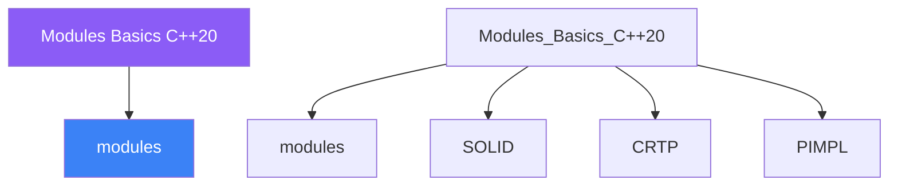

<div class="brain-cluster-banner" data-cluster="modern-cpp">
  🟠 &nbsp; **Modern C++** &nbsp;·&nbsp; Occipital Lobe
</div>


# :material-book: 02 — Definition: Modules Basics C++20

[← Intuition](01-intuition.md) · [Code Example →](03-example.md)

!!! info "🔵 Blue = Theory — Precise, formal, complete"
    Read this section carefully. Every word matters.
    After reading, close the page and explain it back in your own words.

---


## :material-book: Motivation — Why Modules Exist

For 50 years C++ relied on a textual inclusion model inherited from C. Every `#include` directive pastes the entire contents of a header file into the translation unit, causing:

- **Repeated parsing** — `<vector>` may be parsed thousands of times across a large project, once per translation unit that includes it.
- **Macro pollution** — any `#define` in any included file leaks into all subsequent code in that translation unit.
- **Order-sensitive fragility** — `#pragma once` and include guards help but don't eliminate ODR violations when the same symbol is defined differently in different translation units.
- **Slow incremental builds** — a one-line change to a widely-included header triggers a cascade recompilation across the whole project.

C++20 modules address all four issues with a new compilation model: a module is compiled **once** into a Binary Module Interface (BMI), and importers consume the BMI rather than re-parsing source text.

### The Textual Model vs The Module Model

    Textual #include model
    ──────────────────────
    header.h ──► paste into TU1 ──► compile ──► obj1
             └──► paste into TU2 ──► compile ──► obj2
    (header parsed N times, macros escape everywhere)

    Module model
    ────────────
    module.cppm ──► compile once ──► module.pcm  (BMI)
                                       ├──► TU1 imports BMI ──► obj1
                                       └──► TU2 imports BMI ──► obj2
    (module source parsed once, macros do not escape)

The BMI captures the *semantic* interface, not the textual form. Macros defined inside a module do **not** escape the module boundary — they are a preprocessor concept that is not stored in the semantic representation.

## :material-book: Module Interface Units

A **module interface unit** declares the module name with `export module` and marks exported declarations with `export`. The file extension varies by toolchain: `.cppm` (Clang/CMake), `.ixx` (MSVC), or plain `.cpp` with build-system flags.

``` cpp
// math.cppm
export module math;          // declares this file as the interface unit

export int add(int a, int b) { return a + b; }

export double square(double x) { return x * x; }

// Internal helper — NOT exported, invisible to importers
static int clamp_impl(int v, int lo, int hi) {
    return v < lo ? lo : v > hi ? hi : v;
}

export int clamp(int v, int lo, int hi) {
    return clamp_impl(v, lo, hi);
}
```

Consuming the module from another translation unit:

``` cpp
// main.cpp
import math;               // import the compiled BMI — not source text
#include <iostream>        // legacy header still works alongside modules

int main() {
    std::cout << add(3, 4)    << '\n';   // 7
    std::cout << square(2.5)  << '\n';   // 6.25
    std::cout << clamp(15, 0, 10) << '\n'; // 10
    // clamp_impl(…)  ← compile error: not exported
}
```

Key rules:

- `export module <name>;` must appear **before** any other declarations.
- Only one interface unit per named module (unless you use partitions).
- `export` can precede a single declaration, a definition, or a braced `export { }` block to export multiple names at once.

### Export Blocks — Grouping Multiple Symbols

``` cpp
export module geometry;

export {
    struct Point   { double x, y; };
    struct Circle  { Point centre; double radius; };
    double area(Circle c);
}

// Implementation can live in the same file or in a separate impl unit
double area(Circle c) {
    return 3.14159265358979 * c.radius * c.radius;
}
```

## :material-book: Module Implementation Units

Large modules can split interface from implementation to keep the interface unit concise. An **implementation unit** uses `module <name>;` (no `export` keyword).

``` cpp
// geometry_impl.cpp
module geometry;          // implementation unit — contributes to same module

#include <cmath>          // this include does NOT escape to importers
#include <numbers>        // C++20 math constants

double area(Circle c) {
    return std::numbers::pi * c.radius * c.radius;
}
```

The implementation unit sees all declarations from the interface unit without an explicit import. Consumers of the module only ever need the BMI from the interface unit — the implementation unit is completely hidden.


---

## :material-vector-polyline: Knowledge Map (SPATIAL MEMORY — Feature 7)




---

## :material-memory: Quick Definitions Table

| Term | Meaning |
|------|---------|
| `modules` | _modules — key concept for Modules Basics C++20_ |
| `SOLID` | _SOLID — key concept for Modules Basics C++20_ |
| `CRTP` | _CRTP — key concept for Modules Basics C++20_ |
| `PIMPL` | _PIMPL — key concept for Modules Basics C++20_ |
| `std::variant` | _std::variant — key concept for Modules Basics C++20_ |


---

[← Intuition](01-intuition.md) · [Code Example →](03-example.md)
