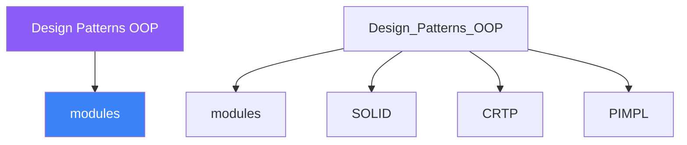

<div class="brain-cluster-banner" data-cluster="modern-cpp">
  🟠 &nbsp; **Modern C++** &nbsp;·&nbsp; Occipital Lobe
</div>


# :material-book: 02 — Definition: Design Patterns OOP

[← Intuition](01-intuition.md) · [Code Example →](03-example.md)

!!! info "🔵 Blue = Theory — Precise, formal, complete"
    Read this section carefully. Every word matters.
    After reading, close the page and explain it back in your own words.

---


## :material-book: Motivation — Why Patterns Matter (and When They Don't)

The Gang of Four (GoF) book catalogued 23 recurring solutions to common OOP design problems in 1994. Many of those solutions were written around the limitations of C++98: no lambdas, no `std::function`, no type deduction. Modern C++ lets you express the same *intent* with far less boilerplate — but the underlying *design insight* is just as valuable.

A pattern is a **name** for a recurring design decision, not a prescription for how many classes to create. Knowing the names lets teams communicate: "this is an Observer", "this violates Strategy", without writing paragraphs.

When patterns become over-engineering:

- You have one implementation today and no concrete reason to expect another.
- The extra abstraction layer doubles the call depth without adding testability.
- The pattern was chosen because it sounds impressive, not because it solves a real changeability problem.

Rule of thumb: **introduce a pattern when the pain it solves already exists**, not in anticipation of hypothetical future pain.

## :material-book: GoF Pattern Overview

Creational       Structural        Behavioural
    ─────────────    ──────────────    ────────────────────
    Factory Method   Adapter           Observer
    Abstract Factory Bridge            Strategy
    Builder          Composite         Command
    Prototype        Decorator         Template Method
    Singleton        Facade            Iterator
                     Flyweight         State
                     Proxy             Chain of Responsibility
                                       Visitor / Interpreter

This day covers five patterns most relevant to C++ OOP: Factory Method, Observer, Strategy, Decorator, and Command.

## :material-book: Factory Method

**Intent:** Define an interface for creating an object, but let subclasses (or a factory function) decide which class to instantiate. Decouples creation from usage.

**Classic OOP problem:** A `Logger` factory that must choose between `FileLogger`, `ConsoleLogger`, and `SyslogLogger` based on configuration.

**Modern C++ implementation using \`\`std::unique_ptr\`\` and a registry map:**

``` cpp
// logger.hpp
#include <memory>
#include <string>
#include <unordered_map>
#include <functional>
#include <stdexcept>

struct Logger {
    virtual ~Logger() = default;
    virtual void log(std::string_view msg) = 0;
};

struct ConsoleLogger : Logger {
    void log(std::string_view msg) override {
        std::puts(msg.data());
    }
};

struct FileLogger : Logger {
    explicit FileLogger(std::string path) : path_{std::move(path)} {}
    void log(std::string_view msg) override { /* write to file */ }
private:
    std::string path_;
};

// Factory registry — maps string keys to creator lambdas
class LoggerFactory {
public:
    using Creator = std::function<std::unique_ptr<Logger>()>;

    static LoggerFactory& instance() {
        static LoggerFactory f;
        return f;
    }

    void register_type(std::string name, Creator fn) {
        registry_[std::move(name)] = std::move(fn);
    }

    std::unique_ptr<Logger> create(const std::string& name) const {
        auto it = registry_.find(name);
        if (it == registry_.end())
            throw std::invalid_argument("Unknown logger: " + name);
        return it->second();
    }

private:
    std::unordered_map<std::string, Creator> registry_;
};

// Registration (typically in a .cpp file or module implementation unit)
inline void register_default_loggers() {
    auto& f = LoggerFactory::instance();
    f.register_type("console", []{ return std::make_unique<ConsoleLogger>(); });
    f.register_type("file",    []{ return std::make_unique<FileLogger>("/tmp/app.log"); });
}
```

Usage:

``` cpp
register_default_loggers();
auto logger = LoggerFactory::instance().create("console");
logger->log("Hello, factory!");
```

**Tradeoff:** The registry approach is open for extension (new types can register without touching existing code — OCP), but it uses runtime `std::string` lookup. If performance matters and the set of types is fixed, prefer a `switch` on an enum or a template factory.


---

## :material-vector-polyline: Knowledge Map (SPATIAL MEMORY — Feature 7)




---

## :material-memory: Quick Definitions Table

| Term | Meaning |
|------|---------|
| `modules` | _modules — key concept for Design Patterns OOP_ |
| `SOLID` | _SOLID — key concept for Design Patterns OOP_ |
| `CRTP` | _CRTP — key concept for Design Patterns OOP_ |
| `PIMPL` | _PIMPL — key concept for Design Patterns OOP_ |
| `std::variant` | _std::variant — key concept for Design Patterns OOP_ |


---

[← Intuition](01-intuition.md) · [Code Example →](03-example.md)
