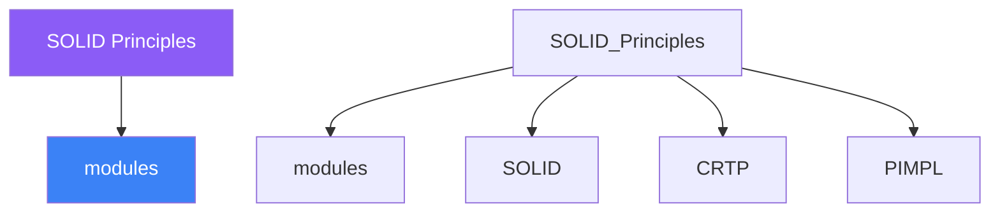

<div class="brain-cluster-banner" data-cluster="modern-cpp">
  🟠 &nbsp; **Modern C++** &nbsp;·&nbsp; Occipital Lobe
</div>


# :material-book: 02 — Definition: SOLID Principles

[← Intuition](01-intuition.md) · [Code Example →](03-example.md)

!!! info "🔵 Blue = Theory — Precise, formal, complete"
    Read this section carefully. Every word matters.
    After reading, close the page and explain it back in your own words.

---


## :material-book: Motivation — Why SOLID?

SOLID is an acronym for five object-oriented design principles articulated by Robert C. Martin. They answer the question: "How do I structure my classes so the system stays easy to change, test, and extend over its lifetime?"

Each principle names a distinct failure mode:

- SRP — classes that do too many things break for too many reasons.
- OCP — code that requires modification for every extension is fragile.
- LSP — subtypes that behave unexpectedly break polymorphic code silently.
- ISP — fat interfaces force clients to depend on methods they don't use.
- DIP — classes that reach up to concrete details are hard to test.

These principles are not rules to follow blindly. Applying them costs abstraction complexity. The right time to apply them is when the failure mode they prevent has already appeared, or when you are designing for a known axis of change.

## :material-book: Single Responsibility Principle (SRP)

**A class should have only one reason to change.**

"Reason to change" maps to "actor" — the stakeholder who owns that responsibility. If two unrelated stakeholders can both force a change to the same class, it has multiple responsibilities.

**BAD — \`\`User\`\` class does user data, persistence, and formatting:**

``` cpp
class User {
public:
    std::string name;
    std::string email;

    // Responsibility 1: business logic
    bool is_valid() const { return !name.empty() && email.contains('@'); }

    // Responsibility 2: persistence — knows about SQL
    void save_to_db(DbConnection& db) {
        db.execute("INSERT INTO users (name,email) VALUES (?,?)", name, email);
    }

    // Responsibility 3: presentation — knows about HTML
    std::string to_html() const {
        return "<p>" + name + " &lt;" + email + "&gt;</p>";
    }
};
```

If the HTML layout changes, the DBA changes the schema, OR the validation rule changes — all three force `User` to be recompiled.

**GOOD — split by responsibility:**

``` cpp
struct User {
    std::string name;
    std::string email;
    bool is_valid() const { return !name.empty() && email.contains('@'); }
};

class UserRepository {
public:
    void save(DbConnection& db, const User& u) {
        db.execute("INSERT INTO users (name,email) VALUES (?,?)", u.name, u.email);
    }
};

class UserPresenter {
public:
    std::string to_html(const User& u) const {
        return "<p>" + u.name + " &lt;" + u.email + "&gt;</p>";
    }
};
```

Each class now has a single owner and a single reason to change.

## :material-book: Open/Closed Principle (OCP)

**Software entities should be open for extension but closed for modification.**

New behaviour should be addable without touching existing, tested code.

**BAD — adding a new shape requires editing \`\`area()\`\`:**

``` cpp
struct Shape { enum Type { Circle, Square } type; };

double area(const Shape& s) {
    if (s.type == Shape::Circle) return 3.14 * s.r * s.r;
    if (s.type == Shape::Square) return s.side * s.side;
    // Must modify this function every time a new shape is added!
    return 0;
}
```

**GOOD — extension via polymorphism or \`\`std::variant\`\`:**

``` cpp
// Polymorphic OCP
struct Shape {
    virtual double area() const = 0;
    virtual ~Shape() = default;
};

struct Circle : Shape {
    double r;
    double area() const override { return 3.14159 * r * r; }
};

struct Square : Shape {
    double side;
    double area() const override { return side * side; }
};

// Adding Triangle requires no change to Circle or Square
struct Triangle : Shape {
    double base, height;
    double area() const override { return 0.5 * base * height; }
};

// OCP with std::variant (C++17) — closed via visitor, open by adding variants
using ShapeV = std::variant<Circle, Square, Triangle>;

struct AreaVisitor {
    double operator()(const Circle&   c) const { return 3.14159 * c.r * c.r; }
    double operator()(const Square&   s) const { return s.side * s.side; }
    double operator()(const Triangle& t) const { return 0.5 * t.base * t.height; }
};

double area(const ShapeV& sv) { return std::visit(AreaVisitor{}, sv); }
```


---

## :material-vector-polyline: Knowledge Map (SPATIAL MEMORY — Feature 7)




---

## :material-memory: Quick Definitions Table

| Term | Meaning |
|------|---------|
| `modules` | _modules — key concept for SOLID Principles_ |
| `SOLID` | _SOLID — key concept for SOLID Principles_ |
| `CRTP` | _CRTP — key concept for SOLID Principles_ |
| `PIMPL` | _PIMPL — key concept for SOLID Principles_ |
| `std::variant` | _std::variant — key concept for SOLID Principles_ |


---

[← Intuition](01-intuition.md) · [Code Example →](03-example.md)
