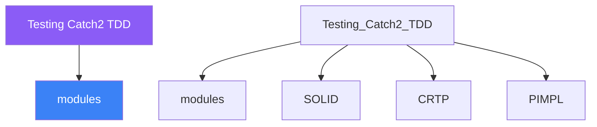

<div class="brain-cluster-banner" data-cluster="modern-cpp">
  🟠 &nbsp; **Modern C++** &nbsp;·&nbsp; Occipital Lobe
</div>


# :material-book: 02 — Definition: Testing Catch2 TDD

[← Intuition](01-intuition.md) · [Code Example →](03-example.md)

!!! info "🔵 Blue = Theory — Precise, formal, complete"
    Read this section carefully. Every word matters.
    After reading, close the page and explain it back in your own words.

---


## :material-book: Motivation — Why Tests Matter in OOP

A C++ class that compiles and links may still be broken. Tests prove that the code does what its design intends — not just that it satisfies the type system. In OOP specifically, tests are the best way to:

- Verify that each class respects its own invariants after every operation.
- Ensure that polymorphic dispatch routes to the correct override.
- Confirm that copy/move semantics and RAII work correctly.
- Guard against regressions when refactoring hierarchies.

Without tests, refactoring a class hierarchy is a leap of faith. With tests, it is a structured procedure with a safety net.

## :material-book: Catch2 Fundamentals

Catch2 is a header-only (single-file) or CMake-installable test framework. It requires no separate `main()` and supports rich assertion macros.

**Setup with CMake (FetchContent):**

``` cmake
include(FetchContent)
FetchContent_Declare(
  Catch2
  GIT_REPOSITORY https://github.com/catchorg/Catch2.git
  GIT_TAG        v3.5.2
)
FetchContent_MakeAvailable(Catch2)

add_executable(tests test_bank.cpp)
target_link_libraries(tests PRIVATE Catch2::Catch2WithMain)
```

**Basic test structure:**

``` cpp
#include <catch2/catch_test_macros.hpp>

// TEST_CASE is the outer container — visible in test runner output
TEST_CASE("BankAccount initial state", "[bank]") {
    BankAccount acc{"Alice", 100.0};

    // SECTION creates a branch — each runs independently from the top
    SECTION("balance equals constructor argument") {
        REQUIRE(acc.balance() == 100.0);
    }

    SECTION("owner name is set correctly") {
        REQUIRE(acc.owner() == "Alice");
    }
}
```

`REQUIRE` fails the test and stops execution. `CHECK` records the failure but continues — useful for checking multiple postconditions that may all fail.

## :material-book: Core Assertion Macros

``` cpp
REQUIRE(expr);               // fails and stops if expr is false
CHECK(expr);                 // records failure, continues
REQUIRE_FALSE(expr);         // fails if expr is true
REQUIRE_THROWS(expr);        // fails if no exception is thrown
REQUIRE_THROWS_AS(expr, T);  // fails unless exception of type T is thrown
REQUIRE_NOTHROW(expr);       // fails if any exception is thrown
REQUIRE_THAT(val, matcher);  // Hamcrest-style matchers
```

**Approximate floating-point comparison:**

``` cpp
#include <catch2/catch_approx.hpp>

REQUIRE(area(Circle{1.0}) == Catch::Approx(3.14159).epsilon(1e-4));
```

**String matchers:**

``` cpp
#include <catch2/matchers/catch_matchers_string.hpp>
using namespace Catch::Matchers;

REQUIRE_THAT(greeting, ContainsSubstring("Hello"));
REQUIRE_THAT(filename, EndsWith(".cpp"));
```


---

## :material-vector-polyline: Knowledge Map (SPATIAL MEMORY — Feature 7)




---

## :material-memory: Quick Definitions Table

| Term | Meaning |
|------|---------|
| `modules` | _modules — key concept for Testing Catch2 TDD_ |
| `SOLID` | _SOLID — key concept for Testing Catch2 TDD_ |
| `CRTP` | _CRTP — key concept for Testing Catch2 TDD_ |
| `PIMPL` | _PIMPL — key concept for Testing Catch2 TDD_ |
| `std::variant` | _std::variant — key concept for Testing Catch2 TDD_ |


---

[← Intuition](01-intuition.md) · [Code Example →](03-example.md)
