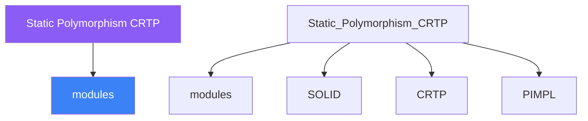

<div class="brain-cluster-banner" data-cluster="modern-cpp">
  🟠 &nbsp; **Modern C++** &nbsp;·&nbsp; Occipital Lobe
</div>


# :material-book: 02 — Definition: Static Polymorphism CRTP

[← Intuition](01-intuition.md) · [Code Example →](03-example.md)

!!! info "🔵 Blue = Theory — Precise, formal, complete"
    Read this section carefully. Every word matters.
    After reading, close the page and explain it back in your own words.

---


## :material-book: Motivation — The Cost of Virtual Dispatch

Virtual dispatch is essential for runtime polymorphism but carries costs:

- **Indirect call** — every virtual method call goes through a vtable pointer; the CPU must load the vtable, load the function pointer, then call it. On a modern CPU this is 3–5 extra memory accesses if the vtable is cold.
- **No inlining** — compilers generally cannot inline a virtual call through a pointer-to-base because the target is unknown at compile time.
- **Object overhead** — every polymorphic object carries a hidden `vptr` (typically 8 bytes on 64-bit systems) pointing to its vtable.
- **Non-value semantics** — polymorphic objects must be passed by pointer or reference, complicating containers and ownership.

When the set of types is known at compile time, **Curiously Recurring Template Pattern (CRTP)** provides compile-time polymorphism with zero runtime overhead.

## :material-book: CRTP Mechanics

CRTP is the idiom where a base class template takes the derived class as its template argument:

``` cpp
template<typename Derived>
struct Base {
    void interface() {
        // Downcast to Derived — safe because Base<Derived> is only
        // ever instantiated as a base of Derived
        static_cast<Derived*>(this)->implementation();
    }
};

struct ConcreteA : Base<ConcreteA> {
    void implementation() { std::puts("ConcreteA"); }
};

struct ConcreteB : Base<ConcreteB> {
    void implementation() { std::puts("ConcreteB"); }
};
```

    Class hierarchy (CRTP)
    ──────────────────────
    Base<ConcreteA>          Base<ConcreteB>
         ▲                        ▲
    ConcreteA                ConcreteB

    No common base class — these are distinct types.
    interface() in Base<D> is resolved at compile time via static_cast<D*>(this).

The call `Base<ConcreteA>::interface()` expands to `static_cast<ConcreteA*>(this)->implementation()` — the compiler sees the concrete type statically and can inline the call.

## :material-book: Static Interface Enforcement

CRTP enforces that a derived class implements required methods. If `ConcreteA` forgets `implementation()`, the program fails to compile when `base.interface()` is instantiated — not at runtime.

``` cpp
template<typename Derived>
struct Serialisable {
    std::string serialise() const {
        return static_cast<const Derived*>(this)->to_string();
    }
    // Optionally add a static_assert for a cleaner error message:
    static void check() {
        static_assert(
            requires(const Derived& d){ d.to_string(); },
            "Derived must implement to_string() const");
    }
};

struct Point : Serialisable<Point> {
    double x, y;
    std::string to_string() const {
        return std::format("({},{})", x, y);
    }
};

struct Missing : Serialisable<Missing> {
    // no to_string() — compile error when serialise() is called
};
```

With C++20 Concepts, static interface enforcement is even cleaner (see Day 10), but CRTP remains useful for **providing default implementations** that call customisation points.


---

## :material-vector-polyline: Knowledge Map (SPATIAL MEMORY — Feature 7)




---

## :material-memory: Quick Definitions Table

| Term | Meaning |
|------|---------|
| `modules` | _modules — key concept for Static Polymorphism CRTP_ |
| `SOLID` | _SOLID — key concept for Static Polymorphism CRTP_ |
| `CRTP` | _CRTP — key concept for Static Polymorphism CRTP_ |
| `PIMPL` | _PIMPL — key concept for Static Polymorphism CRTP_ |
| `std::variant` | _std::variant — key concept for Static Polymorphism CRTP_ |


---

[← Intuition](01-intuition.md) · [Code Example →](03-example.md)
