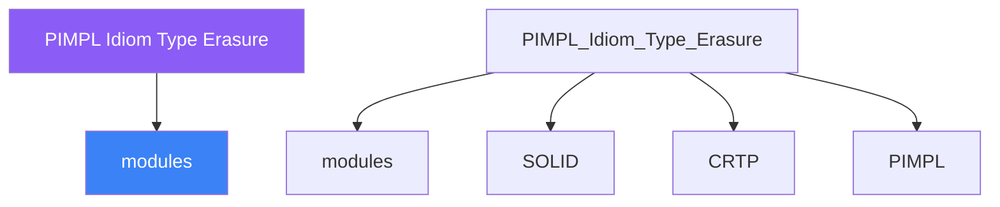

<div class="brain-cluster-banner" data-cluster="modern-cpp">
  🟠 &nbsp; **Modern C++** &nbsp;·&nbsp; Occipital Lobe
</div>


# :material-book: 02 — Definition: PIMPL Idiom Type Erasure

[← Intuition](01-intuition.md) · [Code Example →](03-example.md)

!!! info "🔵 Blue = Theory — Precise, formal, complete"
    Read this section carefully. Every word matters.
    After reading, close the page and explain it back in your own words.

---


## :material-book: Motivation — Hiding Implementation Details

Two recurring problems in C++ library design:

**Problem 1 — Compilation Firewall:** A header file for a class exposes all private members to every consumer because C++ class layout must be fully known at the point of use. Changing a private member (e.g., adding a new internal `std::string`) forces a recompilation of every translation unit that includes the header — even though the public API didn't change. On large codebases this cascades into minutes or hours of unnecessary rebuilding.

**Problem 2 — ABI Stability:** Shared libraries (.so / .dll) are compiled once and loaded at runtime. If the library's private members change (a private `int` becomes `long`, a `std::vector` is added), the binary layout of the class changes. Applications compiled against the old header become binary incompatible — a crash waiting to happen. This is the **Fragile Base Class problem** at the ABI level.

Both problems are solved by the **pImpl idiom** (Pointer to Implementation), which hides all private state behind an opaque pointer.

## :material-book: The pImpl Idiom

``` cpp
// widget.hpp  (public header — stable, ABI-safe)
#pragma once
#include <memory>
#include <string>

class Widget {
public:
    explicit Widget(std::string title);
    ~Widget();                    // defined in .cpp — not inline

    Widget(Widget&&) noexcept;
    Widget& operator=(Widget&&) noexcept;

    // Copy is optional — only if Impl is copyable
    Widget(const Widget&);
    Widget& operator=(const Widget&);

    void show();
    void hide();
    std::string title() const;

private:
    struct Impl;                         // forward declaration only
    std::unique_ptr<Impl> pImpl_;        // opaque pointer
};
```

``` cpp
// widget.cpp  (implementation — not part of the public ABI)
#include "widget.hpp"
#include <vector>      // consumers never see these
#include <map>
#include <some_heavy_internal_library.hpp>

struct Widget::Impl {
    std::string         title;
    std::vector<int>    children;   // can change freely — no ABI impact
    bool                visible{false};
};

Widget::Widget(std::string title)
    : pImpl_{std::make_unique<Impl>()} {
    pImpl_->title = std::move(title);
}

Widget::~Widget() = default;   // MUST be defined here, not in the header
                                // (incomplete Impl type at header inclusion)

Widget::Widget(Widget&&) noexcept = default;
Widget& Widget::operator=(Widget&&) noexcept = default;

Widget::Widget(const Widget& o)
    : pImpl_{std::make_unique<Impl>(*o.pImpl_)} {}

Widget& Widget::operator=(const Widget& o) {
    if (this != &o) *pImpl_ = *o.pImpl_;
    return *this;
}

void Widget::show()  { pImpl_->visible = true; }
void Widget::hide()  { pImpl_->visible = false; }
std::string Widget::title() const { return pImpl_->title; }
```

**Why \`\`~Widget()\`\` must be in the \`\`.cpp\`\`:**

`std::unique_ptr<Impl>`'s destructor calls `delete Impl`. At the point where the destructor is generated (wherever `~Widget()` is defined), `Impl` must be a complete type. If `~Widget()` is defaulted in the header, the compiler tries to generate it there — but `Impl` is only forward-declared. Defining `~Widget() = default;` in the `.cpp` where `Impl` is complete solves this.

    pImpl layout
    ─────────────
    ┌──────────────────────┐
    │  Widget (public API) │         ← consumers only see this
    │  ┌──────────────────┐│
    │  │  pImpl_ ──────────┼────────► Impl (heap)
    │  └──────────────────┘│         │  title: string
    └──────────────────────┘         │  children: vector
                                      │  visible: bool
                                      └──────────────────

**ABI stability:** Adding a new member to `Impl` does not change the layout of `Widget` (still just one pointer). Recompiling only the library `.cpp` is sufficient; applications need not be recompiled.

## :material-book: Type Erasure — Duck Typing at Runtime

**Type erasure** allows code to work with values of any type that satisfies a conceptual interface, without that type inheriting from a base class. `std::function`, `std::any`, and `std::shared_ptr<void>` are all type-erasing vocabulary types in the standard library.

**\`\`std::function\`\` — type-erasing a callable:**

``` cpp
#include <functional>

// Accepts any callable matching (int) -> int
std::function<int(int)> double_fn = [](int x){ return x * 2; };
std::function<int(int)> square_fn = [](int x){ return x * x; };

// Also works with member function pointers:
struct Multiplier {
    int factor;
    int apply(int x) const { return x * factor; }
};

Multiplier m{3};
std::function<int(int)> triple_fn =
    std::bind(&Multiplier::apply, &m, std::placeholders::_1);

// Or a capturing lambda:
int factor = 5;
std::function<int(int)> times5 = [factor](int x){ return x * factor; };
```

The concrete type (lambda, function pointer, `Multiplier`) is erased — the caller only sees `std::function<int(int)>`.

**\`\`std::any\`\` — type-erasing a value:**

``` cpp
#include <any>

std::any value = 42;              // holds int
value = std::string("hello");     // now holds string — no inheritance needed
value = std::vector<int>{1,2,3};  // now holds vector<int>

// Access with type check:
if (auto* s = std::any_cast<std::string>(&value))
    std::cout << *s << '\n';

// Throws std::bad_any_cast on type mismatch:
try {
    int i = std::any_cast<int>(value);   // value holds string — throws
} catch (const std::bad_any_cast& e) {
    std::cerr << e.what() << '\n';
}
```


---

## :material-vector-polyline: Knowledge Map (SPATIAL MEMORY — Feature 7)




---

## :material-memory: Quick Definitions Table

| Term | Meaning |
|------|---------|
| `modules` | _modules — key concept for PIMPL Idiom Type Erasure_ |
| `SOLID` | _SOLID — key concept for PIMPL Idiom Type Erasure_ |
| `CRTP` | _CRTP — key concept for PIMPL Idiom Type Erasure_ |
| `PIMPL` | _PIMPL — key concept for PIMPL Idiom Type Erasure_ |
| `std::variant` | _std::variant — key concept for PIMPL Idiom Type Erasure_ |


---

[← Intuition](01-intuition.md) · [Code Example →](03-example.md)
