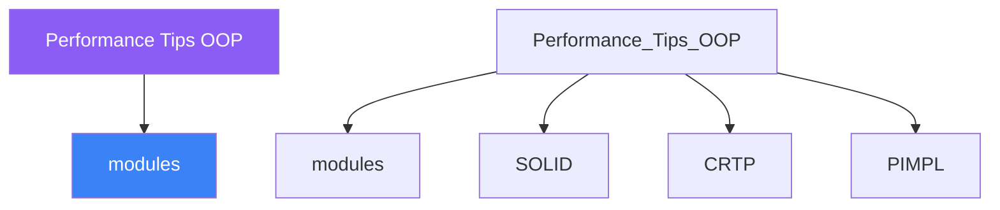

<div class="brain-cluster-banner" data-cluster="modern-cpp">
  🟠 &nbsp; **Modern C++** &nbsp;·&nbsp; Occipital Lobe
</div>


# :material-book: 02 — Definition: Performance Tips OOP

[← Intuition](01-intuition.md) · [Code Example →](03-example.md)

!!! info "🔵 Blue = Theory — Precise, formal, complete"
    Read this section carefully. Every word matters.
    After reading, close the page and explain it back in your own words.

---


## :material-book: Motivation — Measure Before You Optimise

Most OOP performance advice is anecdotal without benchmarks. The principles below are real and measurable, but their *magnitude* depends entirely on your specific workload, data sizes, and CPU. The only reliable process is:

1.  **Profile first** — identify the hot path with `perf`, VTune, or `gprof`.
2.  **Hypothesise the cause** — cache miss? virtual call? allocation?
3.  **Benchmark the change** — use `google/benchmark` or `nanobench`.
4.  **Verify the improvement** — compare assembly if needed.

This day introduces the conceptual models and C++ techniques that most commonly yield measurable improvements in OOP code.

## :material-book: Cache Lines and Data Locality

Modern CPUs read memory in **cache lines** (64 bytes on x86). If your data fits in cache, arithmetic is fast. If it doesn't, the CPU stalls waiting for RAM — this is the **cache miss** penalty (50–200 cycles on a modern CPU vs 1–4 cycles for L1 cache).

**Struct of Arrays (SoA) vs Array of Structs (AoS):**

``` cpp
// AoS layout — common OOP default
struct Particle {
    float px, py, pz;    // position
    float vx, vy, vz;    // velocity
    float mass;
    int   alive;
    char  tag[8];        // 32 bytes total
};

std::vector<Particle> particles(10000);

// To update only positions: iterate all particles,
// but each particle loads 32 bytes though only 12 (px,py,pz) are used.
// → 10000 × 32 bytes = 312 KB loaded, but only 120 KB needed.
// Cache efficiency: ~38%

// SoA layout — data-oriented design
struct ParticleSystem {
    std::vector<float> px, py, pz;      // positions
    std::vector<float> vx, vy, vz;      // velocities
    std::vector<float> mass;
    std::vector<int>   alive;
};

// Position update: accesses only px, py, pz → 120 KB, 100% cache utilised
// SIMD auto-vectorisation: contiguous floats → compiler uses AVX2/SSE
```

    AoS memory layout (cache unfriendly for partial updates)
    ─────────────────────────────────────────────────────────
    [px py pz vx vy vz mass alive tag] [px py pz ...] ...
    ^──────────── 32 bytes ───────────^

    SoA memory layout (cache friendly — all px values are adjacent)
    ───────────────────────────────────────────────────────────────
    px: [p0 p1 p2 p3 p4 p5 p6 p7 ...]   ← one cache line serves 16 floats
    py: [p0 p1 p2 p3 p4 p5 p6 p7 ...]
    pz: [p0 p1 p2 p3 p4 p5 p6 p7 ...]

## :material-book: Virtual Call Cost and Devirtualisation

A virtual call through a pointer-to-base requires:

1.  Load the `vptr` from the object.
2.  Load the function pointer from the vtable at the correct offset.
3.  Indirect call to that address.

On a warm cache this costs ~3–5 cycles. On a cold cache (many different derived types, large objects far apart in memory), the vtable itself may be a cache miss, and the indirect branch predictor may mispredict the target — total cost 40–100 cycles.

**Devirtualisation** is when the compiler proves the dynamic type at compile time and converts the virtual call to a direct (or inlined) call:

``` cpp
struct Animal { virtual void speak() const = 0; };
struct Dog : Animal { void speak() const override { std::puts("Woof"); } };

void call_speak(const Animal& a) {
    a.speak();   // virtual call — type unknown here
}

void call_devirt() {
    Dog d;
    d.speak();   // non-virtual call — compiler knows Dog; may inline
}

// Also devirtualised via final:
struct Cat final : Animal { void speak() const override { std::puts("Meow"); } };

void call_cat(const Cat& c) {
    c.speak();   // devirtualised because Cat is final
}
```

Use `final` on leaf classes that are never further derived — it allows the compiler and linker to devirtualise aggressively, sometimes inlining the entire virtual method body.


---

## :material-vector-polyline: Knowledge Map (SPATIAL MEMORY — Feature 7)




---

## :material-memory: Quick Definitions Table

| Term | Meaning |
|------|---------|
| `modules` | _modules — key concept for Performance Tips OOP_ |
| `SOLID` | _SOLID — key concept for Performance Tips OOP_ |
| `CRTP` | _CRTP — key concept for Performance Tips OOP_ |
| `PIMPL` | _PIMPL — key concept for Performance Tips OOP_ |
| `std::variant` | _std::variant — key concept for Performance Tips OOP_ |


---

[← Intuition](01-intuition.md) · [Code Example →](03-example.md)
