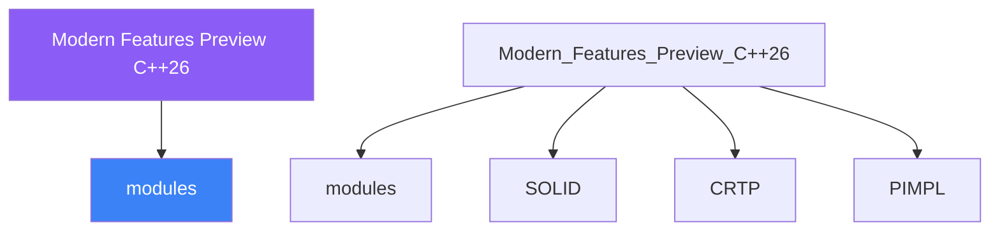

<div class="brain-cluster-banner" data-cluster="modern-cpp">
  🟠 &nbsp; **Modern C++** &nbsp;·&nbsp; Occipital Lobe
</div>


# :material-book: 02 — Definition: Modern Features Preview C++26

[← Intuition](01-intuition.md) · [Code Example →](03-example.md)

!!! info "🔵 Blue = Theory — Precise, formal, complete"
    Read this section carefully. Every word matters.
    After reading, close the page and explain it back in your own words.

---


## :material-book: Motivation — The Evolving Language

C++ has a three-year release cycle. C++20 delivered modules, concepts, ranges, coroutines, and `std::format`. C++23 delivered `std::expected`, `import std;`, `std::mdspan`, and `std::print`. C++26, finalised in 2026, brings transformative features that change how C++ programmers think about reflection, control flow, correctness, and concurrency.

This day surveys the five most significant C++26 features. Status legend:

- **Merged** — formally voted into the C++26 working draft.
- **Experimental** — available in Clang/GCC trunk under `-std=c++26` or feature flags, but not yet in all compiler releases as of early 2025.

Understanding these features now lets you:

- Evaluate experimental compilers (Clang trunk, EDG) for early adoption.
- Design abstractions today that will migrate cleanly to C++26 idioms.
- Understand the direction of the language for architectural decisions.

## :material-book: Static Reflection — P2996 (Merged into C++26)

Static reflection allows querying properties of types at compile time as first-class language values, without macros or code generation.

The core construct is `^^T` (the reflection operator) which produces a `std::meta::info` constant, and `[:r:]` (the splicer) which turns a `meta::info` back into a syntactic element.

``` cpp
// requires: clang trunk with -freflection or EDG compiler
#include <meta>

struct Point { int x; int y; };

// Iterate over all non-static data members at compile time:
constexpr void print_member_names() {
    // ^^Point reflects the type as a compile-time value
    constexpr auto members = std::meta::nonstatic_data_members_of(^^Point);
    // members is a range of std::meta::info values
    template for (constexpr auto m : members) {
        std::println("member: {}", std::meta::name_of(m));
    }
}
// Output: member: x
//         member: y
```

**Serialisation without macros:**

``` cpp
template<typename T>
std::string to_json(const T& obj) {
    std::string result = "{";
    bool first = true;
    template for (constexpr auto m : std::meta::nonstatic_data_members_of(^^T)) {
        if (!first) result += ",";
        result += "\"";
        result += std::meta::name_of(m);
        result += "\":";
        result += std::to_string(obj.[:m:]);   // splicer accesses the member
        first = false;
    }
    return result + "}";
}

Point p{3, 7};
std::println("{}", to_json(p));   // {"x":3,"y":7}
```

This pattern — which previously required Boost.Hana, a macro + code generator, or manual boilerplate — is now expressed directly in the language.

**Enum-to-string without macros:**

``` cpp
enum class Colour { Red, Green, Blue };

std::string_view colour_name(Colour c) {
    template for (constexpr auto e : std::meta::enumerators_of(^^Colour)) {
        if ([:e:] == c) return std::meta::name_of(e);
    }
    return "<unknown>";
}

std::println("{}", colour_name(Colour::Green));   // "Green"
```

## :material-book: Pattern Matching — P2688 (Targeted for C++26)

Pattern matching provides a structured multi-way dispatch over values and types, extending `switch` to work with arbitrary types including `std::variant`, `std::optional`, structs, and ranges.

``` cpp
// Current C++23 baseline (for comparison)
std::variant<int, double, std::string> v = 42;
std::visit([](auto&& x){
    using T = std::decay_t<decltype(x)>;
    if constexpr (std::is_same_v<T, int>)    std::println("int: {}", x);
    else if constexpr (std::is_same_v<T, double>) std::println("double: {}", x);
    else std::println("string: {}", x);
}, v);

// C++26 pattern matching (P2688 syntax — experimental):
inspect (v) {
    <int>    i => std::println("int: {}", i);
    <double> d => std::println("double: {}", d);
    <std::string> s => std::println("string: {}", s);
};
```

**Structural patterns:**

``` cpp
struct Point { int x, y; };

Point p{3, 0};
inspect (p) {
    [0, 0]     => std::println("origin");
    [x, 0]     => std::println("on x-axis at {}", x);
    [0, y]     => std::println("on y-axis at {}", y);
    [x, y]     => std::println("({}, {})", x, y);
};
// prints: "on x-axis at 3"
```

**\`\`std::optional\`\` pattern:**

``` cpp
std::optional<int> opt = 42;
inspect (opt) {
    none    => std::println("empty");
    some(v) => std::println("has value: {}", v);
};
```

Pattern matching eliminates deep `if`/`else` chains, `dynamic_cast` cascades, and the `overloaded` boilerplate currently needed for `std::visit`.


---

## :material-vector-polyline: Knowledge Map (SPATIAL MEMORY — Feature 7)




---

## :material-memory: Quick Definitions Table

| Term | Meaning |
|------|---------|
| `modules` | _modules — key concept for Modern Features Preview C++26_ |
| `SOLID` | _SOLID — key concept for Modern Features Preview C++26_ |
| `CRTP` | _CRTP — key concept for Modern Features Preview C++26_ |
| `PIMPL` | _PIMPL — key concept for Modern Features Preview C++26_ |
| `std::variant` | _std::variant — key concept for Modern Features Preview C++26_ |


---

[← Intuition](01-intuition.md) · [Code Example →](03-example.md)
