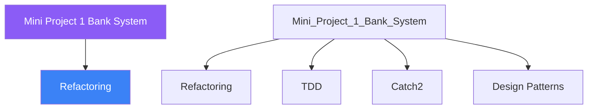

<div class="brain-cluster-banner" data-cluster="projects">
  🟡 &nbsp; **Projects** &nbsp;·&nbsp; Cerebellum
</div>


# :material-book: 02 — Definition: Mini Project 1 Bank System

[← Intuition](01-intuition.md) · [Code Example →](03-example.md)

!!! info "🔵 Blue = Theory — Precise, formal, complete"
    Read this section carefully. Every word matters.
    After reading, close the page and explain it back in your own words.

---


## :material-book: Motivation

The best way to consolidate object-oriented knowledge is to build something real. A bank account system is an ideal first mini-project because every OOP pillar — encapsulation, inheritance, polymorphism, RAII, smart pointers, operator overloading, and exception handling — appears naturally in the domain.

By the end of this day you will have a working multi-account banking library that you could extend into a real application. More importantly, you will see how the separate concepts from Days 1–23 *compose* into a coherent design.

## :material-book: Domain Overview

Our bank system manages:

    BankAccount (base)
    ├── SavingsAccount   — earns interest, minimum balance rule
    └── CheckingAccount  — overdraft protection, per-transaction fee

Supporting infrastructure:

    Transaction          — value type representing one deposit/withdrawal
    TransactionLog       — RAII wrapper around a log file
    InsufficientFunds    — custom exception type
    make_account()       — factory returning unique_ptr<BankAccount>

## :material-book: Design Before Code

Before writing a single line of C++, sketch responsibilities:

``` text
┌─────────────────────────────────┐
│         BankAccount             │
│  # id_      : string            │
│  # owner_   : string            │
│  # balance_ : double            │
│  # log_     : TransactionLog    │
├─────────────────────────────────┤
│  + deposit(amount)              │
│  + withdraw(amount) [virtual]   │
│  + balance() const              │
│  + operator+=(double)           │
│  + operator-=(double)           │
│  + print_statement() const      │
└──────────────┬──────────────────┘
               │
     ┌─────────┴──────────┐
     │                    │
┌────┴────────┐   ┌────────┴────────┐
│SavingsAccount│  │CheckingAccount  │
│rate_: double │  │overdraft_:double│
│min_bal_:dbl  │  │fee_: double     │
│apply_interest│  │withdraw()override│
└─────────────┘  └─────────────────┘
```

The `TransactionLog` lives *inside* `BankAccount` as a member. This is RAII: the log file opens when the account is created and closes automatically when the account is destroyed, even if an exception is thrown.


---

## :material-vector-polyline: Knowledge Map (SPATIAL MEMORY — Feature 7)




---

## :material-memory: Quick Definitions Table

| Term | Meaning |
|------|---------|
| `Refactoring` | _Refactoring — key concept for Mini Project 1 Bank System_ |
| `TDD` | _TDD — key concept for Mini Project 1 Bank System_ |
| `Catch2` | _Catch2 — key concept for Mini Project 1 Bank System_ |
| `Design Patterns` | _Design Patterns — key concept for Mini Project 1 Bank System_ |
| `CMake` | _CMake — key concept for Mini Project 1 Bank System_ |


---

[← Intuition](01-intuition.md) · [Code Example →](03-example.md)
