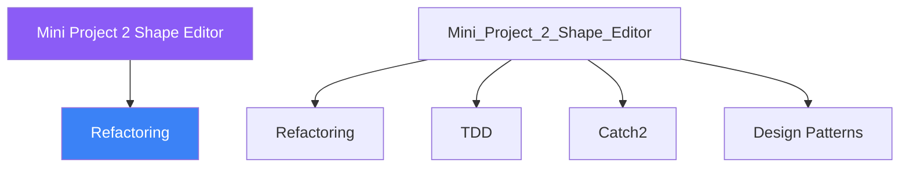

<div class="brain-cluster-banner" data-cluster="projects">
  🟡 &nbsp; **Projects** &nbsp;·&nbsp; Cerebellum
</div>


# :material-book: 02 — Definition: Mini Project 2 Shape Editor

[← Intuition](01-intuition.md) · [Code Example →](03-example.md)

!!! info "🔵 Blue = Theory — Precise, formal, complete"
    Read this section carefully. Every word matters.
    After reading, close the page and explain it back in your own words.

---


## :material-book: Motivation

The shape editor is the classic OOP teaching example — but this day goes beyond the introductory version. You will see four progressively modern approaches to the same problem:

1.  Classic virtual-function polymorphism (Open/Closed Principle via vtable).
2.  The Visitor pattern (add new operations without modifying shape classes).
3.  `std::variant` as a type-safe union alternative to inheritance.
4.  `std::ranges` for filtering and transforming shape collections.

By comparing the tradeoffs you will develop the judgment to choose the right tool for each situation in real code.

## :material-book: Domain Overview

``` text
Shape (abstract base)
├── Circle     — radius
├── Rectangle  — width, height
└── Triangle   — base, height
```

Operations needed:

- Compute area and perimeter of any shape.
- Render / describe any shape as a string.
- Serialise a collection to JSON.
- Filter a collection (e.g., keep only shapes with area \> threshold).
- Create shapes from a string type tag (factory).

## :material-book: Approach 1: Classic Virtual Polymorphism

The foundational approach — each shape overrides a pure virtual interface.

``` cpp
#include <cmath>
#include <numbers>   // C++20: std::numbers::pi
#include <string>

class Shape {
public:
    virtual ~Shape() = default;

    // Pure virtual interface — every shape MUST implement these
    [[nodiscard]] virtual double area()      const = 0;
    [[nodiscard]] virtual double perimeter() const = 0;
    [[nodiscard]] virtual std::string describe() const = 0;
    [[nodiscard]] virtual std::string type_name() const = 0;
};

class Circle : public Shape {
public:
    explicit Circle(double radius) : r_{radius} {
        if (r_ <= 0.0)
            throw std::invalid_argument("Circle radius must be positive");
    }

    double area()      const override {
        return std::numbers::pi * r_ * r_;
    }
    double perimeter() const override {
        return 2.0 * std::numbers::pi * r_;
    }
    std::string describe()   const override {
        return "Circle(r=" + std::to_string(r_) + ")";
    }
    std::string type_name()  const override { return "circle"; }
    double radius() const { return r_; }

private:
    double r_;
};

class Rectangle : public Shape {
public:
    Rectangle(double w, double h) : w_{w}, h_{h} {
        if (w_ <= 0.0 || h_ <= 0.0)
            throw std::invalid_argument("Rectangle dimensions must be positive");
    }

    double area()      const override { return w_ * h_; }
    double perimeter() const override { return 2.0 * (w_ + h_); }
    std::string describe()   const override {
        return "Rectangle(" + std::to_string(w_) +
               "x" + std::to_string(h_) + ")";
    }
    std::string type_name()  const override { return "rectangle"; }

private:
    double w_, h_;
};

class Triangle : public Shape {
public:
    Triangle(double base, double height, double a, double b, double c)
        : base_{base}, height_{height}, a_{a}, b_{b}, c_{c}
    {}

    double area()      const override { return 0.5 * base_ * height_; }
    double perimeter() const override { return a_ + b_ + c_; }
    std::string describe()   const override {
        return "Triangle(b=" + std::to_string(base_) +
               " h=" + std::to_string(height_) + ")";
    }
    std::string type_name()  const override { return "triangle"; }

private:
    double base_, height_, a_, b_, c_;
};
```

**When to use**: when you have a stable set of types but expect to add new operations rarely. Virtual dispatch has a small runtime cost but is readable and extensible through subclassing.


---

## :material-vector-polyline: Knowledge Map (SPATIAL MEMORY — Feature 7)




---

## :material-memory: Quick Definitions Table

| Term | Meaning |
|------|---------|
| `Refactoring` | _Refactoring — key concept for Mini Project 2 Shape Editor_ |
| `TDD` | _TDD — key concept for Mini Project 2 Shape Editor_ |
| `Catch2` | _Catch2 — key concept for Mini Project 2 Shape Editor_ |
| `Design Patterns` | _Design Patterns — key concept for Mini Project 2 Shape Editor_ |
| `CMake` | _CMake — key concept for Mini Project 2 Shape Editor_ |


---

[← Intuition](01-intuition.md) · [Code Example →](03-example.md)
