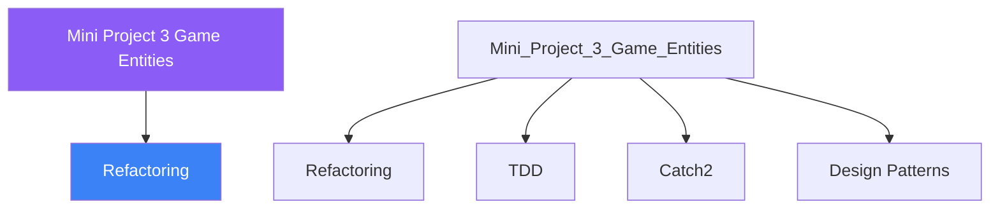

<div class="brain-cluster-banner" data-cluster="projects">
  🟡 &nbsp; **Projects** &nbsp;·&nbsp; Cerebellum
</div>


# :material-book: 02 — Definition: Mini Project 3 Game Entities

[← Intuition](01-intuition.md) · [Code Example →](03-example.md)

!!! info "🔵 Blue = Theory — Precise, formal, complete"
    Read this section carefully. Every word matters.
    After reading, close the page and explain it back in your own words.

---


## :material-book: Motivation

Game development stress-tests every OOP skill: performance matters, objects are created and destroyed rapidly, behaviour combinations are unpredictable, and systems must communicate without tight coupling.

This day introduces four foundational game-engine patterns:

- **Entity-Component System (ECS)** — favour composition over deep inheritance.
- **Game loop** — a deterministic fixed-timestep update cycle.
- **Observer / Event system** — decoupled communication between systems.
- **CRTP** — zero-overhead static polymorphism for entity types.

You will also glimpse spatial partitioning (a performance concept used in collision detection) to motivate the next layer of game-engine study.

## :material-book: The Problem with Deep Inheritance in Games

A naive OOP approach leads to an explosion of types:

``` text
Entity
├── Actor
│   ├── Player
│   │   ├── ArmedPlayer
│   │   └── FlyingPlayer
│   └── Enemy
│       ├── FlyingEnemy
│       └── ArmedFlyingEnemy   ← combinatorial explosion!
└── Projectile
```

Adding "swimming" ability to some but not all entities requires inserting a new layer in the hierarchy. With ECS, "swimming" is just a `SwimComponent` that you attach to any entity at runtime.

## :material-book: The Entity-Component System (ECS)

An *Entity* is just an ID. All data lives in *Components*. *Systems* iterate over entities that have a specific set of components.

``` cpp
#include <any>
#include <cstdint>
#include <functional>
#include <memory>
#include <string>
#include <typeindex>
#include <unordered_map>
#include <vector>

using EntityId = std::uint32_t;

// ---- Components (plain data, no behaviour) ----

struct PositionComponent {
    float x{0.f}, y{0.f};
};

struct VelocityComponent {
    float dx{0.f}, dy{0.f};
};

struct HealthComponent {
    int current{100}, max{100};
    bool is_alive() const { return current > 0; }
};

struct RenderComponent {
    std::string sprite_name;
    float       scale{1.f};
};

// ---- Entity Registry ----

class EntityRegistry {
public:
    EntityId create() {
        EntityId id = next_id_++;
        components_[id];  // insert empty map for this entity
        return id;
    }

    template<typename T>
    void add_component(EntityId id, T component) {
        components_[id][std::type_index(typeid(T))] =
            std::make_any<T>(std::move(component));
    }

    template<typename T>
    T* get_component(EntityId id) {
        auto entity_it = components_.find(id);
        if (entity_it == components_.end()) return nullptr;
        auto comp_it = entity_it->second.find(std::type_index(typeid(T)));
        if (comp_it == entity_it->second.end()) return nullptr;
        return std::any_cast<T>(&comp_it->second);
    }

    template<typename T>
    bool has_component(EntityId id) const {
        auto entity_it = components_.find(id);
        if (entity_it == components_.end()) return false;
        return entity_it->second.count(std::type_index(typeid(T))) > 0;
    }

    void destroy(EntityId id) { components_.erase(id); }

    // Iterate all entities
    const auto& all() const { return components_; }

private:
    EntityId next_id_{1};
    std::unordered_map<
        EntityId,
        std::unordered_map<std::type_index, std::any>
    > components_;
};
```


---

## :material-vector-polyline: Knowledge Map (SPATIAL MEMORY — Feature 7)




---

## :material-memory: Quick Definitions Table

| Term | Meaning |
|------|---------|
| `Refactoring` | _Refactoring — key concept for Mini Project 3 Game Entities_ |
| `TDD` | _TDD — key concept for Mini Project 3 Game Entities_ |
| `Catch2` | _Catch2 — key concept for Mini Project 3 Game Entities_ |
| `Design Patterns` | _Design Patterns — key concept for Mini Project 3 Game Entities_ |
| `CMake` | _CMake — key concept for Mini Project 3 Game Entities_ |


---

[← Intuition](01-intuition.md) · [Code Example →](03-example.md)
