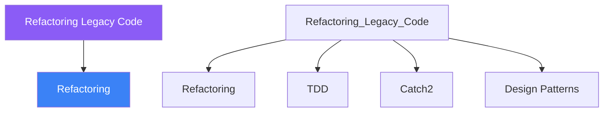

<div class="brain-cluster-banner" data-cluster="projects">
  🟡 &nbsp; **Projects** &nbsp;·&nbsp; Cerebellum
</div>


# :material-book: 02 — Definition: Refactoring Legacy Code

[← Intuition](01-intuition.md) · [Code Example →](03-example.md)

!!! info "🔵 Blue = Theory — Precise, formal, complete"
    Read this section carefully. Every word matters.
    After reading, close the page and explain it back in your own words.

---


## :material-book: Motivation

Most professional C++ work involves changing existing code, not writing from scratch. Legacy codebases are full of patterns that were written before modern C++ existed, under time pressure, or by programmers who later grew.

Refactoring is the discipline of improving internal structure without changing observable behaviour. Done well it is one of the highest-value engineering activities. Done badly it introduces regressions.

This day teaches a disciplined, incremental approach: identify smells, add tests *first*, apply one small transformation at a time, and measure the improvement.

## :material-book: Recognising Code Smells

A *code smell* is a symptom that suggests a deeper problem. Common C++ smells:

**Long Method**  
A function longer than ~30 lines that mixes multiple levels of abstraction. It is hard to name, test, or reuse any single part of it.

**God Class**  
A class with 20+ member functions, 10+ data members, and responsibilities from multiple domains. It is a magnet for bugs because every change risks side effects.

**Deep Inheritance**  
A hierarchy five or more levels deep. Changing a behaviour near the root breaks every leaf class. Tracing `virtual` dispatch requires understanding every level.

**Data Clumps**  
The same group of variables (`x`, `y`, `width`, `height`) appears in 10 functions as separate parameters. They should be a struct.

**Magic Numbers**  
Literal numbers in logic (`if (code == 7)`). Nobody remembers what `7` means six months later.

**Raw Owning Pointers**  
`new`/`delete` in application code without RAII wrappers. Any thrown exception creates a memory leak.

**Mutable Global State**  
Singletons and global variables that make functions impossible to test in isolation and introduce subtle ordering dependencies.

## :material-book: The Strangler Fig Pattern

The safest approach for large refactors is the *Strangler Fig*: grow the new system alongside the old one, redirect traffic incrementally, then remove the old code when it is no longer called.

``` text
Phase 1: Old code runs, new code exists but is not called yet
┌─────────────┐           ┌─────────────┐
│  Old System │           │  New System │  (built but dormant)
└─────────────┘           └─────────────┘

Phase 2: New code handles some requests
┌─────────────┐    ───►   ┌─────────────┐
│  Old System │ ◄─── some │  New System │
└─────────────┘    ───►   └─────────────┘

Phase 3: Old code is dead and can be deleted
                          ┌─────────────┐
                          │  New System │
                          └─────────────┘
```

The golden rule: **never refactor without tests.**


---

## :material-vector-polyline: Knowledge Map (SPATIAL MEMORY — Feature 7)




---

## :material-memory: Quick Definitions Table

| Term | Meaning |
|------|---------|
| `Refactoring` | _Refactoring — key concept for Refactoring Legacy Code_ |
| `TDD` | _TDD — key concept for Refactoring Legacy Code_ |
| `Catch2` | _Catch2 — key concept for Refactoring Legacy Code_ |
| `Design Patterns` | _Design Patterns — key concept for Refactoring Legacy Code_ |
| `CMake` | _CMake — key concept for Refactoring Legacy Code_ |


---

[← Intuition](01-intuition.md) · [Code Example →](03-example.md)
