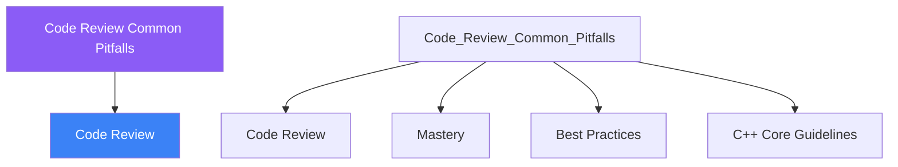

  ⚪ &nbsp; **Review & Mastery** &nbsp;·&nbsp; Brain Stem

# :material-book: 02 — Definition: Code Review Common Pitfalls

[← Intuition](01-intuition.md) · [Code Example →](03-example.md)

!!! info "🔵 Blue = Theory — Precise, formal, complete"
    Read this section carefully. Every word matters.
    After reading, close the page and explain it back in your own words.

---

## :material-book: Motivation

Code review is where knowledge transfers between engineers and where accumulated bugs are caught before they reach users. A reviewer who does not know the common C++ anti-patterns will miss the most dangerous issues. A reviewee who cannot defend their choices wastes everyone's time.

This day gives you a structured mental checklist for every C++ review, a catalogue of the most impactful anti-patterns, and practical guidance on how to integrate automated tools so humans focus on what machines cannot check.

## :material-book: How to Give a Code Review

Effective code reviews are structured. Work through these layers in order:

**Layer 1 — Correctness**  
Does the code do what the ticket/spec says? Are edge cases handled? Can it panic, deadlock, or produce undefined behaviour? This is the most important layer — style is irrelevant if the code is wrong.

**Layer 2 — Safety and Resource Management**  
Are all resources (memory, files, locks) acquired via RAII? Is ownership clear (`unique_ptr` vs raw pointer)? Is exception safety considered?

**Layer 3 — Interface Design**  
Is the API minimal and expressive? Do parameter names, types, and `const` qualifiers communicate intent? Could the interface be misused by accident?

**Layer 4 — Performance**  
Are there unnecessary copies? Is the wrong container chosen for the access pattern? Are `std::string` temporaries being created in tight loops?

**Layer 5 — Style and Readability**  
Naming, formatting, comment quality. These are important but should not dominate the review if layers 1–4 are clean.

## :material-book: How to Receive a Code Review

- Treat every comment as a question, not an attack.
- Respond to every comment — either fix it, explain why you disagree, or ask for clarification. "Done" and "Good point, will fix in a follow-up" are both acceptable. Silent ignoring is not.
- Do not rewrite unrelated code in response to review feedback — that creates noise and is harder to review.
- If a reviewer's suggestion makes the code worse, explain why calmly with reference to the C++ Core Guidelines or the style guide.

---

## :material-vector-polyline: Knowledge Map (SPATIAL MEMORY — Feature 7)

---

## :material-memory: Quick Definitions Table

| Term | Meaning |
|------|---------|
| `Code Review` | _Code Review — key concept for Code Review Common Pitfalls_ |
| `Mastery` | _Mastery — key concept for Code Review Common Pitfalls_ |
| `Best Practices` | _Best Practices — key concept for Code Review Common Pitfalls_ |
| `C++ Core Guidelines` | _C++ Core Guidelines — key concept for Code Review Common Pitfalls_ |

---

[← Intuition](01-intuition.md) · [Code Example →](03-example.md)
