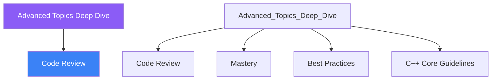

<div class="brain-cluster-banner" data-cluster="review">
  ⚪ &nbsp; **Review & Mastery** &nbsp;·&nbsp; Brain Stem
</div>


# :material-book: 02 — Definition: Advanced Topics Deep Dive

[← Intuition](01-intuition.md) · [Code Example →](03-example.md)

!!! info "🔵 Blue = Theory — Precise, formal, complete"
    Read this section carefully. Every word matters.
    After reading, close the page and explain it back in your own words.

---


## :material-book: Motivation

C++20 introduced several features that change the way high-performance and systems-level code is written. This day covers five topics that reward the effort to understand them deeply:

1.  **Coroutines** — `co_await`, `co_yield`, `co_return` for asynchronous and lazy computation without callbacks.
2.  **Custom allocators** — controlling where and how memory is acquired.
3.  **\`\`consteval\`\`** — functions that *must* run at compile time.
4.  **\`\`std::bit_cast\`\`** — type-punning without undefined behaviour.
5.  **Compile-time algorithms with \`\`constexpr\`\`** — sorting, searching, and computing lookup tables at compile time.

These features are used in game engines, embedded firmware, network servers, and anywhere performance or determinism is critical.

## :material-book: Coroutines: Concepts

A *coroutine* is a function that can suspend and resume execution. Unlike threads, suspension is cooperative and happens at explicit `co_await` / `co_yield` points — no context switch, no mutex.

Three keywords:

- `co_return` — produces the final value and terminates the coroutine.
- `co_yield` — produces an intermediate value and suspends.
- `co_await` — suspends until an awaitable completes.

The coroutine machinery requires a *promise type* and a *coroutine handle*. C++20 provides the plumbing; you define the semantics.

### Generator (co_yield)

A generator produces a lazy sequence without storing all values upfront.

``` cpp
#include <coroutine>
#include <optional>
#include <stdexcept>

// Minimal generator type
template<typename T>
class Generator {
public:
    struct promise_type {
        std::optional<T> value_;

        Generator get_return_object() {
            return Generator{
                std::coroutine_handle<promise_type>::from_promise(*this)};
        }
        std::suspend_always  initial_suspend() noexcept { return {}; }
        std::suspend_always  final_suspend()   noexcept { return {}; }
        std::suspend_always  yield_value(T v) noexcept {
            value_ = std::move(v);
            return {};
        }
        void return_void()  {}
        void unhandled_exception() { std::rethrow_exception(
                                         std::current_exception()); }
    };

    using handle_type = std::coroutine_handle<promise_type>;

    explicit Generator(handle_type h) : handle_{h} {}
    ~Generator() { if (handle_) handle_.destroy(); }

    // Non-copyable — owns the coroutine handle
    Generator(const Generator&)            = delete;
    Generator& operator=(const Generator&) = delete;
    Generator(Generator&& o) noexcept : handle_{o.handle_} {
        o.handle_ = nullptr;
    }

    bool next() {
        handle_.resume();
        return !handle_.done();
    }

    T value() const {
        return *handle_.promise().value_;
    }

private:
    handle_type handle_;
};

// A coroutine function using co_yield
Generator<int> fibonacci() {
    int a = 0, b = 1;
    while (true) {
        co_yield a;
        auto next = a + b;
        a = b;
        b = next;
    }
}

// Usage: lazily consume first 10 Fibonacci numbers
void print_fibonacci() {
    auto gen = fibonacci();
    for (int i = 0; i < 10; ++i) {
        gen.next();
        std::cout << gen.value() << ' ';
    }
    // Output: 0 1 1 2 3 5 8 13 21 34
}
```

### Task (co_await)

`co_await` is used for asynchronous work — the coroutine suspends until the awaited operation is complete (I/O, a timer, another coroutine).

``` cpp
// Simplified task type — wraps a coroutine that returns one value
template<typename T>
struct Task {
    struct promise_type {
        T result_;
        std::exception_ptr exception_;

        Task get_return_object() {
            return Task{
                std::coroutine_handle<promise_type>::from_promise(*this)};
        }
        std::suspend_never  initial_suspend() noexcept { return {}; }
        std::suspend_always final_suspend()   noexcept { return {}; }

        void return_value(T v) { result_ = std::move(v); }
        void unhandled_exception() {
            exception_ = std::current_exception();
        }
    };

    using handle_type = std::coroutine_handle<promise_type>;
    handle_type handle_;

    explicit Task(handle_type h) : handle_{h} {}
    ~Task() { if (handle_) handle_.destroy(); }

    T get() {
        if (handle_.promise().exception_)
            std::rethrow_exception(handle_.promise().exception_);
        return handle_.promise().result_;
    }
};
```

## :material-book: Custom Allocators

The default allocator calls `::operator new` for every allocation. In performance-critical code, custom allocators can:

- Use a pre-allocated pool (no system calls during use).
- Use stack memory for small allocations.
- Track all allocations for debugging.

A minimal polymorphic allocator using `std::pmr`:

``` cpp
#include <memory_resource>
#include <vector>
#include <array>

void demo_pmr_allocator() {
    // Stack buffer — no heap allocation at all
    std::array<std::byte, 4096> buffer;
    std::pmr::monotonic_buffer_resource pool{buffer.data(), buffer.size()};

    // vector uses our pool, not the global heap
    std::pmr::vector<int> v{&pool};
    for (int i = 0; i < 100; ++i)
        v.push_back(i);

    // All memory freed when pool goes out of scope — O(1) deallocation
}

// A pool allocator for a fixed-size object type
template<typename T, std::size_t N>
class PoolAllocator {
public:
    using value_type = T;

    PoolAllocator() : next_{pool_} {}

    T* allocate(std::size_t n) {
        if (n != 1) throw std::bad_alloc{};
        if (next_ >= pool_ + N) throw std::bad_alloc{};
        return next_++;
    }

    void deallocate(T*, std::size_t) noexcept {
        // Monotonic: individual deallocation is a no-op
        // All memory reclaimed when PoolAllocator is destroyed
    }

private:
    T pool_[N];
    T* next_;
};
```


---

## :material-vector-polyline: Knowledge Map (SPATIAL MEMORY — Feature 7)




---

## :material-memory: Quick Definitions Table

| Term | Meaning |
|------|---------|
| `Code Review` | _Code Review — key concept for Advanced Topics Deep Dive_ |
| `Mastery` | _Mastery — key concept for Advanced Topics Deep Dive_ |
| `Best Practices` | _Best Practices — key concept for Advanced Topics Deep Dive_ |
| `C++ Core Guidelines` | _C++ Core Guidelines — key concept for Advanced Topics Deep Dive_ |


---

[← Intuition](01-intuition.md) · [Code Example →](03-example.md)
