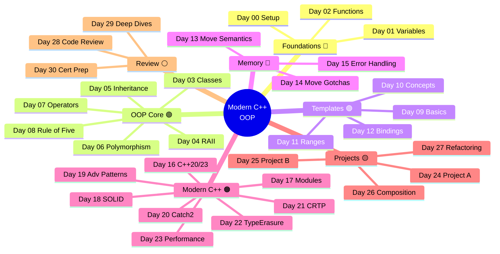
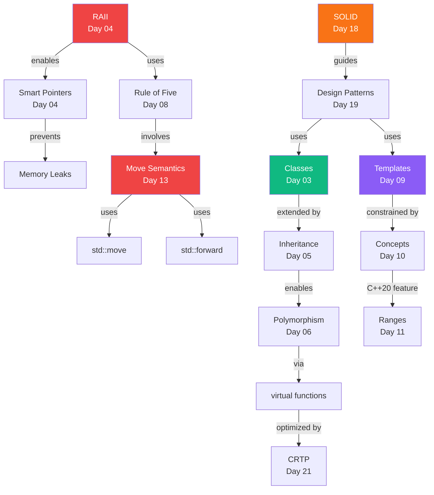

# 🗺️ Mind Map — All 31 Days

!!! tip "Spatial Memory (Feature 7)"
    Use this map to orient yourself in the learning journey.
    Click any day link to jump directly there.

---

## Full Curriculum Mind Map

---

## Knowledge Connections Graph

---

## Learning Path Options

=== "📅 Linear (Recommended)"

    Follow Days 0 → 30 in order.
    Each day builds directly on the previous.

=== "🚀 OOP Fast Track"

    Day 00 → 03 → 04 → 05 → 06 → 08 → 18 → 19

=== "🟣 Templates Deep Dive"

    Day 00 → 09 → 10 → 11 → 21 → 22

=== "🟠 Modern C++ Focus"

    Day 00 → 16 → 17 → 13 → 14 → 15 → 23

